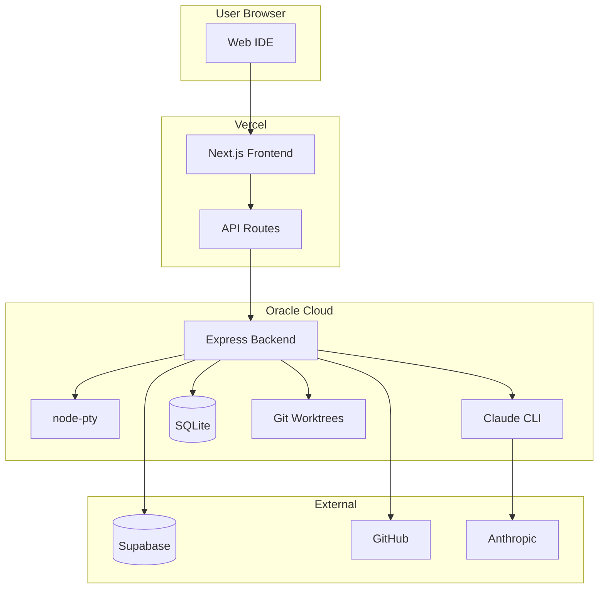

# Lawless AI System Documentation

Comprehensive documentation for the Lawless AI platform - a cloud-hosted AI development environment that integrates Claude Code with real-time collaboration, terminal sessions, and workspace management.

## Documentation Index

| Document | Description |
|----------|-------------|
| [System Architecture](./architecture.md) | High-level system overview, component relationships, data flow |
| [Backend Workers](./backend-workers.md) | Deep-dive into worker implementation, endpoints, scaling |
| [Local IDE Deployment](./local-ide.md) | IDE components, panes, state management, integration |
| [Orchestration Layer](./orchestration.md) | Request routing, authentication, session management |
| [Deployment Workflows](./deployment.md) | CI/CD pipelines, infrastructure, production setup |
| [Market Positioning](./market-positioning.md) | Competitive analysis, value proposition, differentiation |

## Quick Reference

### System Components

```
Frontend (Vercel)     Backend (Oracle Cloud)     Persistence
├─ Next.js 14         ├─ Express.js              ├─ Supabase (Cloud)
├─ IDE Components     ├─ Claude CLI              ├─ SQLite (Local)
├─ API Routes         ├─ node-pty                └─ Git Worktrees
└─ WebSocket Client   └─ WebSocket Server
```

### Key URLs

| Service | URL | Purpose |
|---------|-----|---------|
| Production Frontend | `https://lawless-ai.vercel.app` | Web IDE |
| Backend Worker | `http://147.224.217.154:3001` | API + WebSocket |
| Supabase | `https://jnxfynvgkguaghhorsov.supabase.co` | Cloud persistence |

### Environment Overview



## Architecture Principles

1. **Session Isolation**: Each workspace session gets its own git worktree and branch
2. **Dual Persistence**: SQLite for local speed, Supabase for cloud sync
3. **Real-time Streaming**: SSE for chat, WebSocket for terminal
4. **Graceful Degradation**: Works without Supabase (local-only mode)
5. **Plugin-First**: All distributable AI configurations live in `plugins/`
