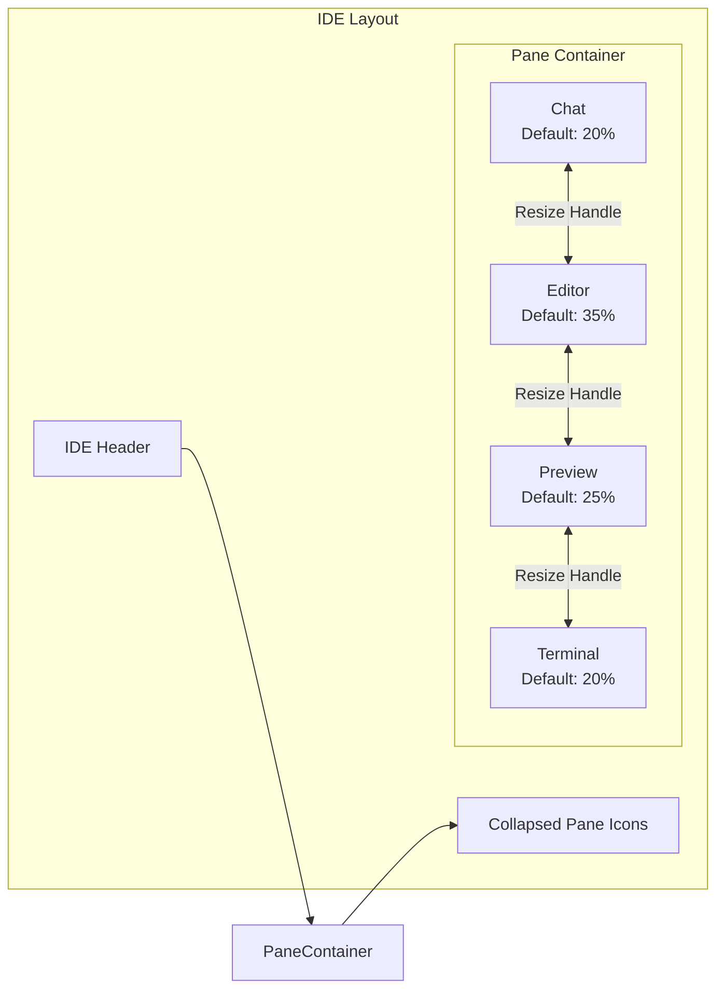
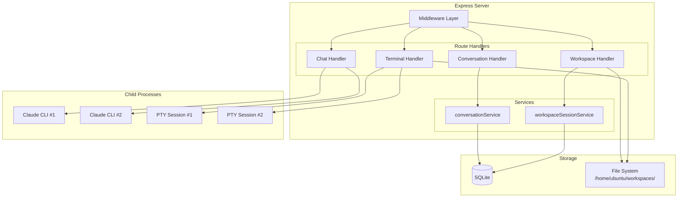
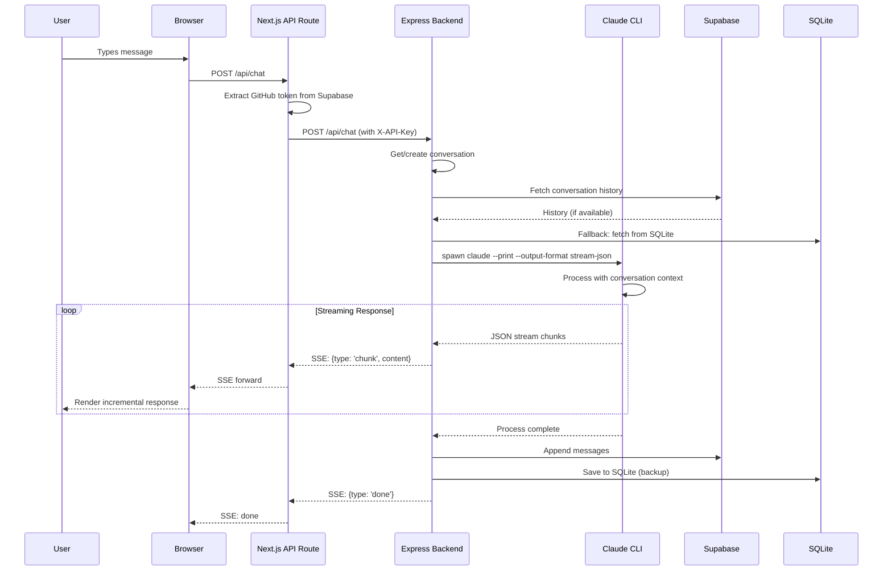
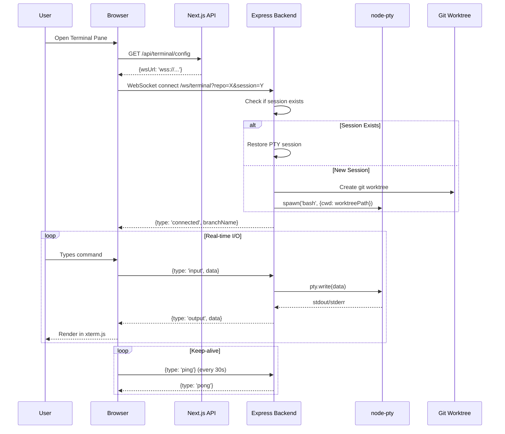
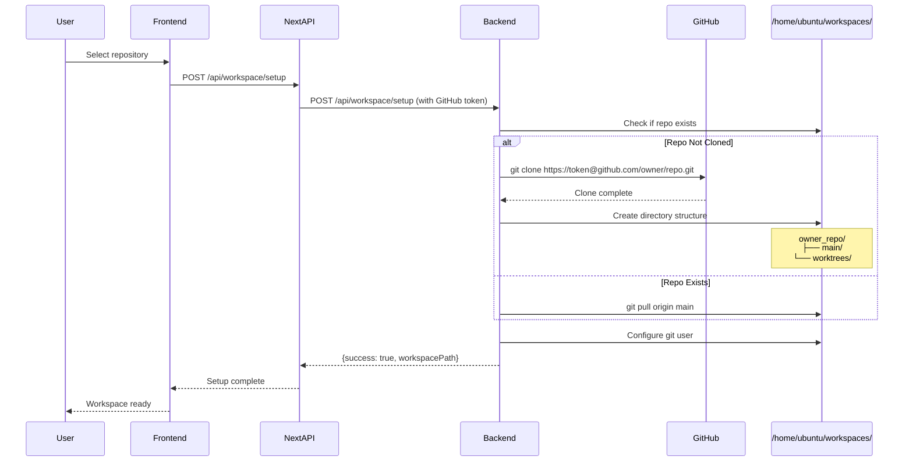
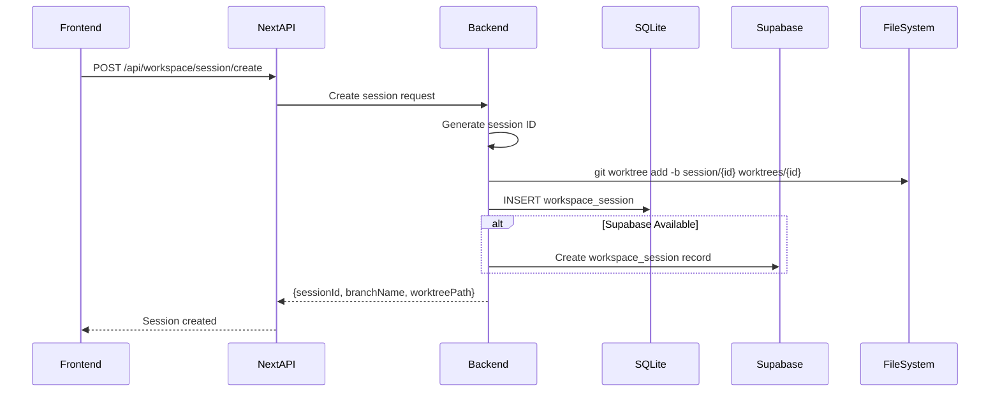
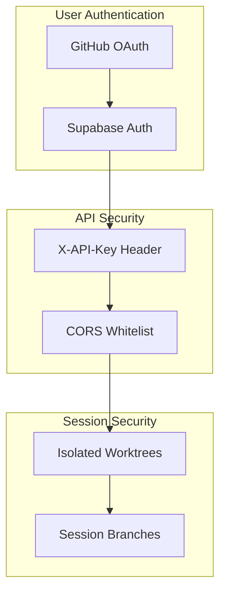
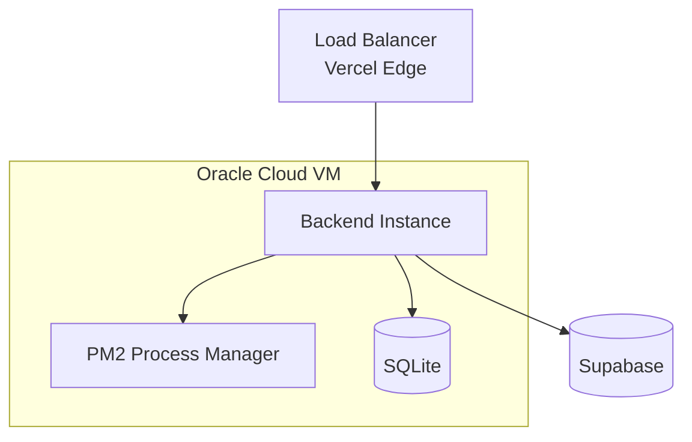
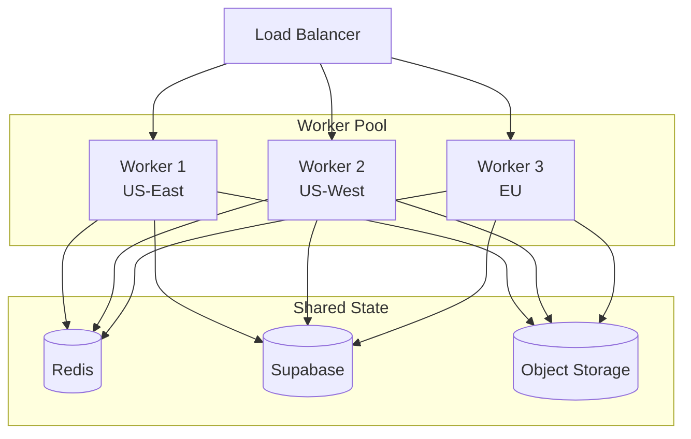

# System Architecture

This document provides a comprehensive overview of the Lawless AI platform architecture, covering all major components, their interactions, and data flows.

## Table of Contents

- [High-Level Overview](#high-level-overview)
- [Component Architecture](#component-architecture)
- [Data Flow Diagrams](#data-flow-diagrams)
- [Technology Stack](#technology-stack)
- [Security Model](#security-model)
- [Scalability Considerations](#scalability-considerations)

---

## High-Level Overview

Lawless AI is a cloud-hosted AI development environment that combines:

- **Web-based IDE** with multi-pane layout (chat, editor, terminal, preview, database, deployments)
- **Claude Code integration** providing AI-assisted development through natural language
- **Real-time terminal sessions** with persistent WebSocket connections
- **Git worktree isolation** ensuring each session has independent branch-based isolation
- **Dual persistence** with local SQLite for speed and Supabase for cloud sync

```mermaid
graph TB
    subgraph "Client Layer"
        Browser[Web Browser]
        NPM[Local IDE Package<br/>@lawless-ai/local-ide-agent]
    end

    subgraph "Frontend Layer - Vercel"
        Next[Next.js 14 Application]
        subgraph "API Routes"
            ChatProxy[/api/chat]
            WorkspaceProxy[/api/workspace/*]
            TerminalProxy[/api/terminal/*]
            IntegrationsAPI[/api/integrations/*]
        end
        subgraph "IDE Components"
            ChatPane[Chat Pane]
            EditorPane[Editor Pane]
            TerminalPane[Terminal Pane]
            PreviewPane[Preview Pane]
            DatabasePane[Database Pane]
            DeploymentsPane[Deployments Pane]
        end
    end

    subgraph "Backend Layer - Oracle Cloud"
        Express[Express.js Server :3001]
        subgraph "Services"
            ClaudeCLI[Claude CLI Process]
            PTY[node-pty Terminal]
            GitMgr[Git Worktree Manager]
            ConvService[Conversation Service]
        end
        SQLite[(SQLite DB)]
        Workspaces[/home/ubuntu/workspaces/]
    end

    subgraph "External Services"
        Anthropic[Anthropic API]
        GitHub[GitHub API]
        Supabase[(Supabase PostgreSQL)]
        Vercel[Vercel API]
    end

    Browser --> Next
    NPM --> Browser
    Next --> ChatProxy
    Next --> WorkspaceProxy
    Next --> TerminalProxy
    ChatProxy --> Express
    WorkspaceProxy --> Express
    TerminalProxy --> Express
    Express --> ClaudeCLI
    Express --> PTY
    Express --> GitMgr
    Express --> ConvService
    Express --> SQLite
    GitMgr --> Workspaces
    ClaudeCLI --> Anthropic
    Express --> GitHub
    Express --> Supabase
    IntegrationsAPI --> Supabase
    IntegrationsAPI --> Vercel
    IntegrationsAPI --> GitHub
```

---

## Component Architecture

### 1. Frontend Application (Next.js 14)

The frontend is a Next.js 14 application deployed on Vercel that provides:

| Component | Location | Purpose |
|-----------|----------|---------|
| IDE Layout | `app/ide/components/IDELayout.tsx` | Multi-pane resizable layout |
| Chat Pane | `app/ide/components/panes/ChatPane/` | AI conversation interface |
| Terminal Pane | `app/ide/components/panes/TerminalPane/` | xterm.js terminal |
| Editor Pane | `app/ide/components/panes/EditorPane/` | CodeMirror code editor |
| Preview Pane | `app/ide/components/panes/PreviewPane/` | Live site preview iframe |
| Database Pane | `app/ide/components/panes/DatabasePane/` | Supabase table viewer |
| Deployments Pane | `app/ide/components/panes/DeploymentsPane/` | Vercel deployment status |

#### IDE Layout Architecture



The pane system supports:
- **Dynamic visibility**: Toggle panes on/off with keyboard shortcuts (Cmd+1-7)
- **Portal-based rendering**: Content persists when panes are collapsed
- **Max 5 panes**: Enforced limit to prevent UI overcrowding
- **Resize handles**: react-resizable-panels for smooth resizing

### 2. Backend Server (Express.js)

The backend is a Node.js Express server running on Oracle Cloud that handles:

| Capability | Implementation | Description |
|------------|----------------|-------------|
| Chat API | `POST /api/chat` | Spawns Claude CLI, streams SSE response |
| Workspace Chat | `POST /api/workspace/chat` | Chat with repository context |
| Terminal Sessions | WebSocket `/ws/terminal` | Real-time PTY streaming |
| Workspace Setup | `POST /api/workspace/setup` | Clone/pull repos, create worktrees |
| Session Management | CRUD `/api/workspace/session/*` | Create, get, list, delete sessions |
| Conversation History | CRUD `/api/conversations/*` | Supabase-backed persistence |
| Git Operations | `/api/workspace/git/*` | Status, commit, push |

#### Backend Process Architecture



### 3. Local IDE Agent Package

The `@lawless-ai/local-ide-agent` npm package enables developers to embed AI assistance in their local development:

```typescript
// User's app layout.tsx
import { LawlessIDEProvider } from '@lawless-ai/local-ide-agent';

export default function RootLayout({ children }) {
  return (
    <html>
      <body>
        {children}
        {process.env.NODE_ENV === 'development' && <LawlessIDEProvider />}
      </body>
    </html>
  );
}
```

Components exported:
- `ClaudeDrawer` - Collapsible chat sidebar
- `ElementInspector` - DOM inspection tool
- `useChat` - Chat state management hook
- `useIDEStore` - Zustand store for IDE state

---

## Data Flow Diagrams

### Chat Request Flow



### Terminal Session Flow



### Workspace Setup Flow



### Session Creation Flow



---

## Technology Stack

### Frontend

| Technology | Version | Purpose |
|------------|---------|---------|
| Next.js | 14.x | React framework with App Router |
| React | 18.x | UI library |
| TypeScript | 5.x | Type safety |
| react-resizable-panels | - | Pane layout management |
| @xterm/xterm | - | Terminal emulation |
| CodeMirror | 6.x | Code editor |
| Zustand | 4.x | State management |

### Backend

| Technology | Version | Purpose |
|------------|---------|---------|
| Node.js | 20.x | Runtime environment |
| Express | 4.x | HTTP server framework |
| node-pty | - | Pseudo-terminal spawning |
| better-sqlite3 | - | Local SQLite database |
| ws | - | WebSocket server |
| uuid | - | Session ID generation |

### Infrastructure

| Service | Provider | Purpose |
|---------|----------|---------|
| Frontend Hosting | Vercel | Next.js deployment, CDN |
| Backend Hosting | Oracle Cloud | VM for Express server |
| Database | Supabase | PostgreSQL + Auth |
| CI/CD | GitHub Actions | Automated deployments |
| Process Manager | PM2 | Backend process lifecycle |

### External APIs

| API | Purpose |
|-----|---------|
| Anthropic | Claude AI inference |
| GitHub | Repository access, OAuth |
| Vercel | Deployment management |
| Supabase | Database, authentication |

---

## Security Model

### Authentication Layers



### Security Measures

1. **API Key Authentication**
   - All backend endpoints require `X-API-Key` header
   - Key validated via middleware
   - Health endpoints exempted for monitoring

2. **CORS Configuration**
   ```javascript
   const allowedOrigins = [
     process.env.FRONTEND_URL,
     'http://localhost:3000',
     'https://lawless-ai.vercel.app'
   ];
   ```

3. **Session Isolation**
   - Each workspace session gets unique branch: `session/{sessionId}`
   - Git worktrees provide filesystem isolation
   - Terminal PTY processes bound to worktree paths

4. **Token Security**
   - GitHub tokens stored encrypted in Supabase
   - Tokens passed via headers, never in URLs
   - Service role keys server-side only

---

## Scalability Considerations

### Current Architecture (Single Worker)



### Horizontal Scaling Path



### Scaling Strategies

| Component | Current | Scale Path |
|-----------|---------|------------|
| Backend | Single VM | Kubernetes pods with HPA |
| Database | SQLite + Supabase | Supabase-only with connection pooling |
| File Storage | Local disk | S3/GCS with workspace sync |
| WebSocket | Single server | Redis Pub/Sub for session affinity |
| Claude CLI | Local process | Queue-based with worker pool |

### Performance Considerations

1. **Connection Pooling**: Supabase connections pooled via `@supabase/supabase-js`
2. **SSE Buffering**: Disabled nginx buffering for real-time streaming
3. **WebSocket Keep-alive**: 30-second ping/pong cycle
4. **Terminal History**: Capped at 1000 lines per session
5. **Workspace Cleanup**: Stale worktrees pruned after inactivity

---

## Next Steps

- [Backend Workers Documentation](./backend-workers.md)
- [Local IDE Documentation](./local-ide.md)
- [Orchestration Layer](./orchestration.md)
- [Deployment Workflows](./deployment.md)
