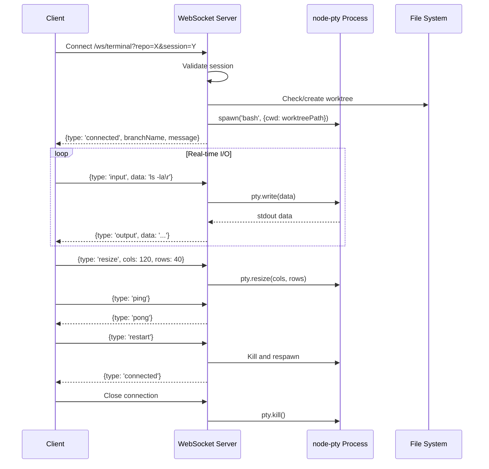
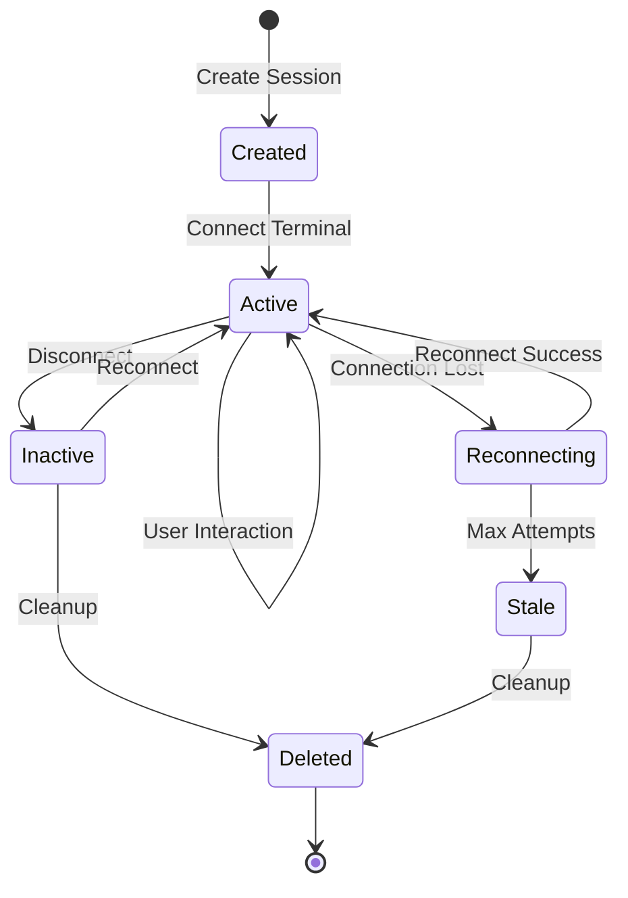
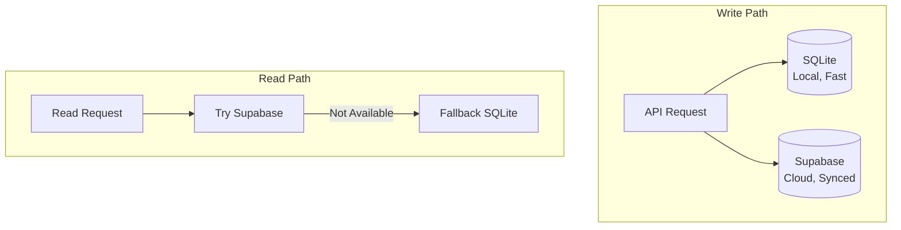

# Backend Workers

This document provides a deep-dive into the Lawless AI backend worker architecture, including all endpoints, services, process management, and operational details.

## Table of Contents

- [Worker Overview](#worker-overview)
- [Server Architecture](#server-architecture)
- [API Endpoints](#api-endpoints)
- [WebSocket Services](#websocket-services)
- [Claude CLI Integration](#claude-cli-integration)
- [Terminal Session Management](#terminal-session-management)
- [Workspace Management](#workspace-management)
- [Database Layer](#database-layer)
- [Process Management](#process-management)
- [Monitoring and Health](#monitoring-and-health)

---

## Worker Overview

The backend worker is an Express.js server running on Oracle Cloud that provides:

| Capability | Technology | Description |
|------------|------------|-------------|
| HTTP API | Express.js | RESTful endpoints for chat, workspace, sessions |
| WebSocket | ws | Real-time terminal streaming |
| AI Processing | Claude CLI | Spawns Claude processes for chat |
| Terminal | node-pty | Pseudo-terminal emulation |
| Local Database | better-sqlite3 | Fast local persistence |
| Cloud Database | Supabase | Distributed persistence and sync |

### Worker Configuration

```typescript
// Worker status API response structure
interface WorkerConfig {
  id: string;          // 'oracle-primary'
  name: string;        // 'Oracle Primary'
  type: 'oracle' | 'aws' | 'gcp' | 'local';
  url: string;         // 'http://147.224.217.154:3001'
  region?: string;     // 'US Chicago'
  features?: string[]; // ['Claude CLI', 'Workspace', 'Terminal', 'WebSocket']
}
```

### Current Production Worker

| Property | Value |
|----------|-------|
| Worker ID | `oracle-primary` |
| URL | `http://147.224.217.154:3001` |
| Region | US Chicago |
| Type | Oracle Cloud VM |
| Features | Claude CLI, Workspace, Terminal, WebSocket |

---

## Server Architecture

```mermaid
graph TB
    subgraph "Express Server :3001"
        MW[Middleware Stack]

        subgraph "Middleware"
            CORS[CORS Handler]
            JSON[JSON Parser]
            Auth[API Key Auth]
        end

        subgraph "HTTP Routes"
            Health[/health, /version]
            Chat[/api/chat]
            WsChat[/api/workspace/chat]
            WsSetup[/api/workspace/setup]
            WsSession[/api/workspace/session/*]
            WsGit[/api/workspace/git/*]
            Conv[/api/conversations/*]
            Term[/api/terminal/*]
            Builder[/api/builder/*]
        end

        subgraph "WebSocket Server"
            WSS[WebSocket Handler]
            TermWS[/ws/terminal]
        end
    end

    subgraph "Child Processes"
        Claude[Claude CLI Processes]
        PTY[PTY Processes]
    end

    subgraph "Storage"
        SQLite[(SQLite<br/>conversations.db)]
        FS[File System<br/>/home/ubuntu/workspaces/]
    end

    subgraph "External"
        Supabase[(Supabase)]
        Anthropic[Anthropic API]
        GitHub[GitHub API]
    end

    MW --> CORS --> JSON --> Auth
    Auth --> Health
    Auth --> Chat
    Auth --> WsChat
    Auth --> WsSetup
    Auth --> WsSession
    Auth --> WsGit
    Auth --> Conv
    Auth --> Term
    Auth --> Builder
    Auth --> WSS
    WSS --> TermWS
    Chat --> Claude
    WsChat --> Claude
    TermWS --> PTY
    WsSession --> SQLite
    WsSession --> Supabase
    Conv --> SQLite
    Conv --> Supabase
    WsSetup --> FS
    WsSetup --> GitHub
    Claude --> Anthropic
```

### Server Initialization

```typescript
const app = express();
const PORT = process.env.PORT || 3001;

// SQLite initialization
const dbPath = process.env.DB_PATH || path.join(__dirname, '..', 'data', 'conversations.db');
const db = new Database(dbPath);

// Table creation
db.exec(`
  CREATE TABLE IF NOT EXISTS conversations (...);
  CREATE TABLE IF NOT EXISTS terminal_sessions (...);
  CREATE TABLE IF NOT EXISTS workspace_sessions (...);
`);

// CORS configuration
const allowedOrigins = [
  process.env.FRONTEND_URL,
  'http://localhost:3000',
  'https://lawless-ai.vercel.app'
];

// Middleware stack
app.use(cors({ origin: corsValidator, credentials: true }));
app.use(express.json());
```

---

## API Endpoints

### Health and Status

| Endpoint | Method | Auth | Description |
|----------|--------|------|-------------|
| `/health` | GET | No | Basic health check |
| `/version` | GET | No | Detailed version and metrics |

```typescript
// GET /health
{
  status: 'ok',
  timestamp: '2026-01-20T...',
  version: '1.0.0',
  commit: 'abc1234'
}

// GET /version
{
  version: '1.0.0',
  commit: 'abc1234',
  node: 'v20.x.x',
  uptime: 12345.67,
  memory: {
    rss: 123456789,
    heapTotal: 12345678,
    heapUsed: 1234567
  },
  timestamp: '2026-01-20T...'
}
```

### Chat Endpoints

#### POST /api/chat

General-purpose chat without workspace context.

```typescript
// Request
{
  message: string;           // User message
  sessionId?: string;        // Session ID (generated if not provided)
  userId?: string;           // User ID for Supabase persistence
  conversationId?: string;   // Existing conversation to continue
}

// Response: Server-Sent Events stream
data: {"type":"chunk","content":"Hello","sessionId":"abc"}
data: {"type":"chunk","content":" there!","sessionId":"abc"}
data: {"type":"done","content":"Hello there!","sessionId":"abc","conversationId":"xyz"}
```

#### POST /api/workspace/chat

Chat with repository context and tool access.

```typescript
// Request
{
  message: string;
  repoFullName: string;              // 'owner/repo'
  sessionId?: string;
  workspaceSessionId?: string;       // Session for worktree context
  conversationHistory?: Message[];   // Client-provided history fallback
  userId?: string;
}

// Response: SSE stream with tool events
data: {"type":"text","content":"Let me read...","sessionId":"abc"}
data: {"type":"tool_use","id":"t1","tool":"Read","input":{"file_path":"/..."}}
data: {"type":"tool_result","id":"t1","tool":"Read","output":"...","success":true}
data: {"type":"text","content":"The file contains...","sessionId":"abc"}
data: {"type":"done","content":"...","sessionId":"abc","conversationId":"xyz"}
```

### Workspace Endpoints

#### POST /api/workspace/setup

Clone or update a repository.

```typescript
// Request
{
  repoFullName: string;   // 'owner/repo'
  githubToken: string;    // GitHub personal access token
}

// Response
{
  success: true,
  workspacePath: '/home/ubuntu/workspaces/owner_repo/main',
  worktreesDir: '/home/ubuntu/workspaces/owner_repo/worktrees'
}
```

#### POST /api/workspace/session/create

Create a new isolated workspace session.

```typescript
// Request
{
  repoFullName: string;
  name?: string;          // Human-readable session name
  baseBranch?: string;    // Base branch (default: 'main')
  userId?: string;
}

// Response
{
  success: true,
  session: {
    sessionId: 'uuid-...',
    branchName: 'session/uuid-...',
    worktreePath: '/home/ubuntu/workspaces/owner_repo/worktrees/uuid-...',
    baseBranch: 'main',
    baseCommit: 'abc1234...'
  }
}
```

#### GET /api/workspace/session/:sessionId

Get session details.

```typescript
// Response
{
  session: {
    session_id: string;
    repo_full_name: string;
    name: string;
    branch_name: string;
    worktree_path: string;
    base_branch: string;
    base_commit: string;
    created_at: string;
    last_accessed_at: string;
  }
}
```

#### GET /api/workspace/sessions

List all sessions for a repository.

```typescript
// Query params
?repo=owner/repo&userId=...

// Response
{
  sessions: WorkspaceSession[]
}
```

#### DELETE /api/workspace/session/:sessionId

Delete a session and its worktree.

### Git Endpoints

#### GET /api/workspace/git/status

```typescript
// Query: ?sessionId=...
// Response
{
  branch: string;
  modified: string[];
  staged: string[];
  untracked: string[];
  ahead: number;
  behind: number;
}
```

#### POST /api/workspace/git/commit

```typescript
// Request
{
  sessionId: string;
  message: string;
  files?: string[];  // Specific files, or all staged
}
```

#### POST /api/workspace/git/push

```typescript
// Request
{
  sessionId: string;
  force?: boolean;
}
```

### Conversation Endpoints

#### GET /api/conversations

```typescript
// Query params
?userId=...&type=workspace&repo=owner/repo&limit=50

// Response
{
  conversations: Conversation[]
}
```

#### GET /api/conversations/:conversationId

#### POST /api/conversations

#### PATCH /api/conversations/:conversationId

#### POST /api/conversations/:conversationId/archive

#### DELETE /api/conversations/:conversationId

---

## WebSocket Services

### Terminal WebSocket: /ws/terminal

The terminal WebSocket provides real-time bidirectional communication with PTY processes.



### Message Types

| Type | Direction | Purpose |
|------|-----------|---------|
| `connected` | Server → Client | Initial connection confirmation |
| `output` | Server → Client | PTY stdout/stderr |
| `error` | Server → Client | Error message |
| `exit` | Server → Client | Process exit notification |
| `pong` | Server → Client | Keep-alive response |
| `input` | Client → Server | User input to PTY |
| `resize` | Client → Server | Terminal dimensions |
| `ping` | Client → Server | Keep-alive ping |
| `restart` | Client → Server | Restart Claude process |

### Connection Parameters

```
wss://backend:3001/ws/terminal?repo={repoFullName}&session={sessionId}
```

---

## Claude CLI Integration

The backend spawns Claude CLI processes for AI interactions.

### Spawn Configuration

```typescript
const spawnEnv = {
  ...process.env,
  NO_COLOR: '1',                                    // Disable ANSI colors
  HOME: '/home/ubuntu',
  PATH: '/usr/local/bin:/usr/bin:/bin:/home/ubuntu/.local/bin'
};

const claude = spawn('claude', [
  '--print',                         // Print mode (non-interactive)
  '--output-format', 'stream-json',  // JSON streaming output
  '--verbose'                        // Verbose mode
], {
  env: spawnEnv,
  cwd: workspacePath                 // Working directory
});

// For workspace chat with tools
spawn('claude', [
  '--print',
  '--output-format', 'stream-json',
  '--verbose',
  '--add-dir', workspacePath,        // Add workspace to context
  '--dangerously-skip-permissions'   // Auto-approve tool usage
], {...});
```

### Stream JSON Processing

```typescript
claude.stdout.on('data', (chunk: Buffer) => {
  buffer += chunk.toString();
  const lines = buffer.split('\n');
  buffer = lines.pop() || '';

  for (const line of lines) {
    const data = JSON.parse(line);

    // Handle different message types
    switch (data.type) {
      case 'assistant':
        // Text content from Claude
        for (const content of data.message.content) {
          if (content.type === 'text') {
            // Stream text delta
          }
          if (content.type === 'tool_use') {
            // Tool invocation
          }
        }
        break;

      case 'tool_result':
        // Tool execution result
        break;

      case 'result':
        // Final result
        break;

      case 'error':
        // Error handling
        break;
    }
  }
});
```

### System Prompts

The backend uses two system prompts:

1. **SYSTEM_PROMPT**: General chat personality and capabilities
2. **WORKSPACE_SYSTEM_PROMPT**: Full tool access with commands, skills, and agents

---

## Terminal Session Management

### Session Lifecycle



### Worktree Structure

```
/home/ubuntu/workspaces/
└── owner_repo/
    ├── main/                          # Primary clone
    │   └── .git/
    └── worktrees/
        ├── session-id-1/              # Branch: session/session-id-1
        ├── session-id-2/              # Branch: session/session-id-2
        └── ...
```

### Session Database Schema

```sql
CREATE TABLE workspace_sessions (
  session_id TEXT PRIMARY KEY,
  repo_full_name TEXT NOT NULL,
  name TEXT NOT NULL,
  branch_name TEXT NOT NULL,
  worktree_path TEXT NOT NULL,
  base_branch TEXT NOT NULL,
  base_commit TEXT NOT NULL,
  created_at DATETIME DEFAULT CURRENT_TIMESTAMP,
  last_accessed_at DATETIME DEFAULT CURRENT_TIMESTAMP
);
```

### Session Operations

```typescript
// Create session with worktree
function createSessionWorktree(repoFullName: string, sessionId: string, baseBranch: string) {
  const mainRepoPath = getMainRepoPath(repoFullName);
  const worktreePath = getWorktreePath(repoFullName, sessionId);
  const branchName = `session/${sessionId}`;

  // Get base commit
  const baseCommit = execSync(`git rev-parse ${baseBranch}`, { cwd: mainRepoPath });

  // Create worktree with new branch
  execSync(`git worktree add -b "${branchName}" "${worktreePath}" ${baseBranch}`, {
    cwd: mainRepoPath
  });

  // Configure git identity
  execSync(`git config user.email "lawless-ai@localhost"`, { cwd: worktreePath });
  execSync(`git config user.name "Lawless AI"`, { cwd: worktreePath });

  // Save to database
  db.prepare(`INSERT INTO workspace_sessions ...`).run(...);
}

// Delete session and cleanup
function deleteSessionWorktree(repoFullName: string, sessionId: string) {
  // Remove worktree
  execSync(`git worktree remove --force "${worktreePath}"`, { cwd: mainRepoPath });

  // Delete branch
  execSync(`git branch -D "${branchName}"`, { cwd: mainRepoPath });

  // Prune worktrees
  execSync('git worktree prune', { cwd: mainRepoPath });

  // Delete from database
  db.prepare('DELETE FROM workspace_sessions WHERE session_id = ?').run(sessionId);
}
```

---

## Database Layer

### Dual Persistence Strategy



### SQLite Schema

```sql
-- Conversations (local backup)
CREATE TABLE conversations (
  session_id TEXT PRIMARY KEY,
  messages TEXT DEFAULT '[]',           -- JSON array
  workspace_session_id TEXT,            -- Link to workspace
  created_at DATETIME DEFAULT CURRENT_TIMESTAMP,
  updated_at DATETIME DEFAULT CURRENT_TIMESTAMP
);

-- Terminal sessions
CREATE TABLE terminal_sessions (
  session_id TEXT PRIMARY KEY,
  repo_full_name TEXT NOT NULL,
  branch_name TEXT NOT NULL,
  worktree_path TEXT NOT NULL,
  base_branch TEXT NOT NULL,
  base_commit TEXT NOT NULL,
  created_at DATETIME DEFAULT CURRENT_TIMESTAMP,
  last_accessed_at DATETIME DEFAULT CURRENT_TIMESTAMP
);

-- Workspace sessions
CREATE TABLE workspace_sessions (
  session_id TEXT PRIMARY KEY,
  repo_full_name TEXT NOT NULL,
  name TEXT NOT NULL,
  branch_name TEXT NOT NULL,
  worktree_path TEXT NOT NULL,
  base_branch TEXT NOT NULL,
  base_commit TEXT NOT NULL,
  created_at DATETIME DEFAULT CURRENT_TIMESTAMP,
  last_accessed_at DATETIME DEFAULT CURRENT_TIMESTAMP
);
```

### Supabase Tables

| Table | Purpose |
|-------|---------|
| `conversations` | Cloud-synced chat history |
| `workspace_sessions` | Workspace metadata |
| `activity_events` | User activity tracking |
| `user_preferences` | User settings |

---

## Process Management

### PM2 Configuration

```javascript
// ecosystem.config.js
module.exports = {
  apps: [{
    name: 'lawless-backend',
    script: 'dist/server.js',
    instances: 1,
    autorestart: true,
    watch: false,
    max_memory_restart: '1G',
    env: {
      NODE_ENV: 'production',
      PORT: 3001
    }
  }]
};
```

### Process Commands

```bash
# Start
pm2 start ecosystem.config.js

# Restart (after deployment)
pm2 restart lawless-backend

# View logs
pm2 logs lawless-backend

# Monitor
pm2 monit
```

---

## Monitoring and Health

### Health Check Endpoint

```typescript
app.get('/health', (_req, res) => {
  res.json({
    status: 'ok',
    timestamp: new Date().toISOString(),
    version: '1.0.0',
    commit: GIT_COMMIT
  });
});
```

### Version Endpoint (Detailed Metrics)

```typescript
app.get('/version', (_req, res) => {
  res.json({
    version: '1.0.0',
    commit: GIT_COMMIT,
    node: process.version,
    uptime: process.uptime(),
    memory: process.memoryUsage(),
    timestamp: new Date().toISOString()
  });
});
```

### Worker Status API

The frontend checks worker status via:

```typescript
// GET /api/workers/status
{
  workers: [{
    id: 'oracle-primary',
    name: 'Oracle Primary',
    type: 'oracle',
    url: 'http://147.224.217.154:3001',
    status: 'online',          // 'online' | 'offline' | 'degraded'
    version: '1.0.0',
    commit: 'abc1234',
    uptime: 12345.67,
    memory: { rss, heapTotal, heapUsed },
    nodeVersion: 'v20.x.x',
    lastChecked: '2026-01-20T...',
    region: 'US Chicago',
    features: ['Claude CLI', 'Workspace', 'Terminal', 'WebSocket']
  }],
  timestamp: '2026-01-20T...'
}
```

### Logging

```typescript
// Request logging
console.log(`[Chat] Request received - userId: ${userId}, sessionId: ${sessionId}`);

// Error logging
console.error('Claude stderr:', errorText);
console.error('Workspace setup error:', error);

// Process logging
console.log(`[Server] SQLite database initialized at: ${dbPath}`);
```

---

## Environment Variables

| Variable | Required | Description |
|----------|----------|-------------|
| `PORT` | No | Server port (default: 3001) |
| `BACKEND_API_KEY` | Yes | API authentication key |
| `FRONTEND_URL` | Yes | Allowed CORS origin |
| `DB_PATH` | No | SQLite database path |
| `WORKSPACE_DIR` | No | Workspace root directory |
| `SUPABASE_URL` | No | Supabase project URL |
| `SUPABASE_SERVICE_KEY` | No | Supabase service role key |
| `SUPABASE_ANON_KEY` | No | Supabase anon key |

---

## Next Steps

- [Local IDE Documentation](./local-ide.md)
- [Orchestration Layer](./orchestration.md)
- [Deployment Workflows](./deployment.md)
