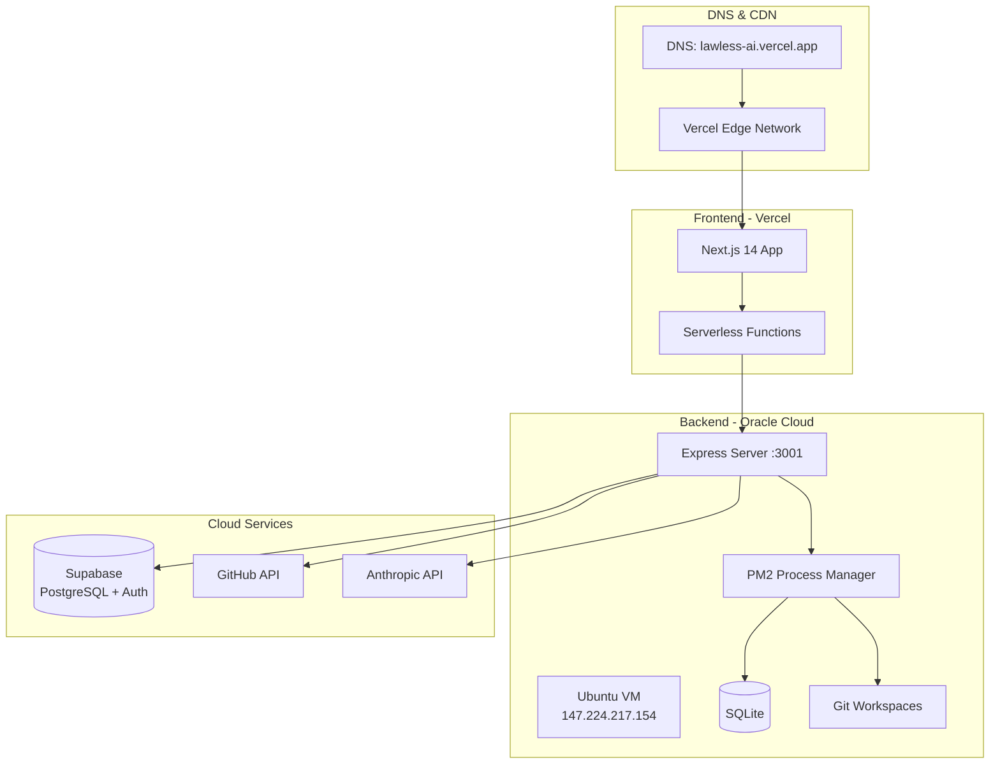
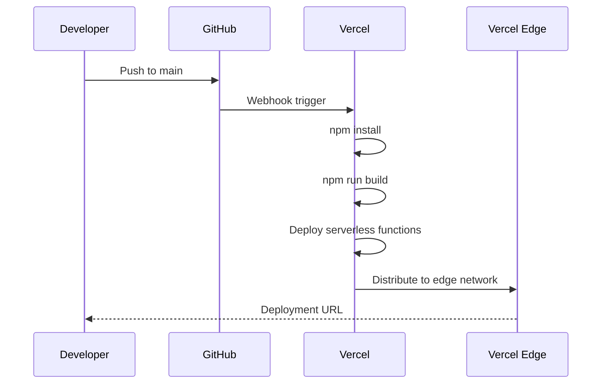
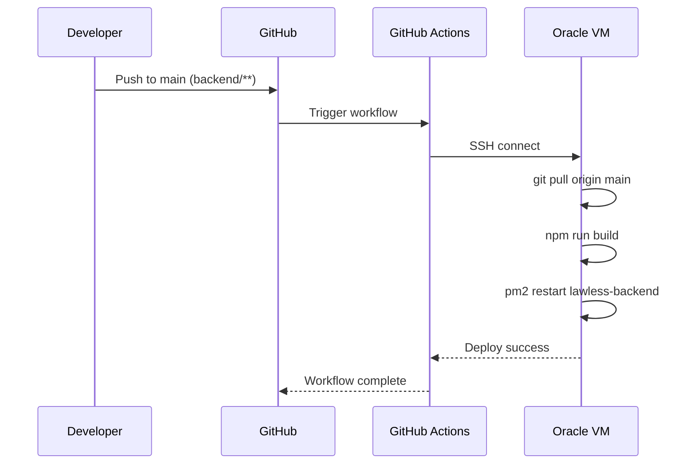
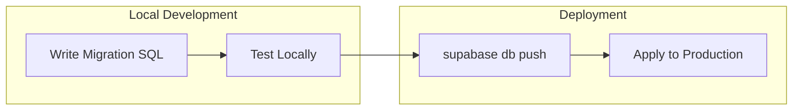
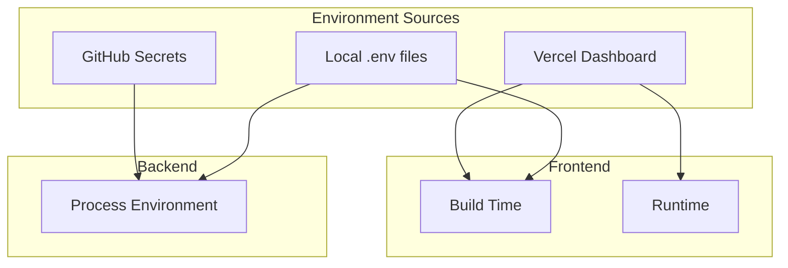
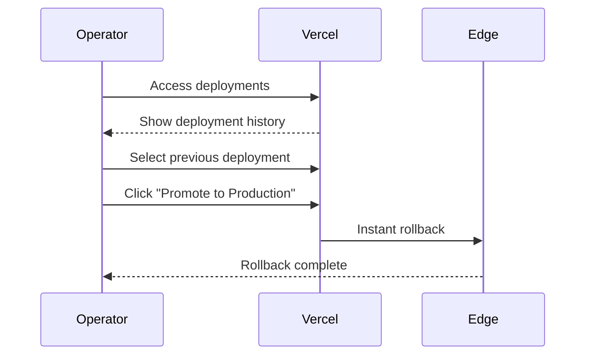
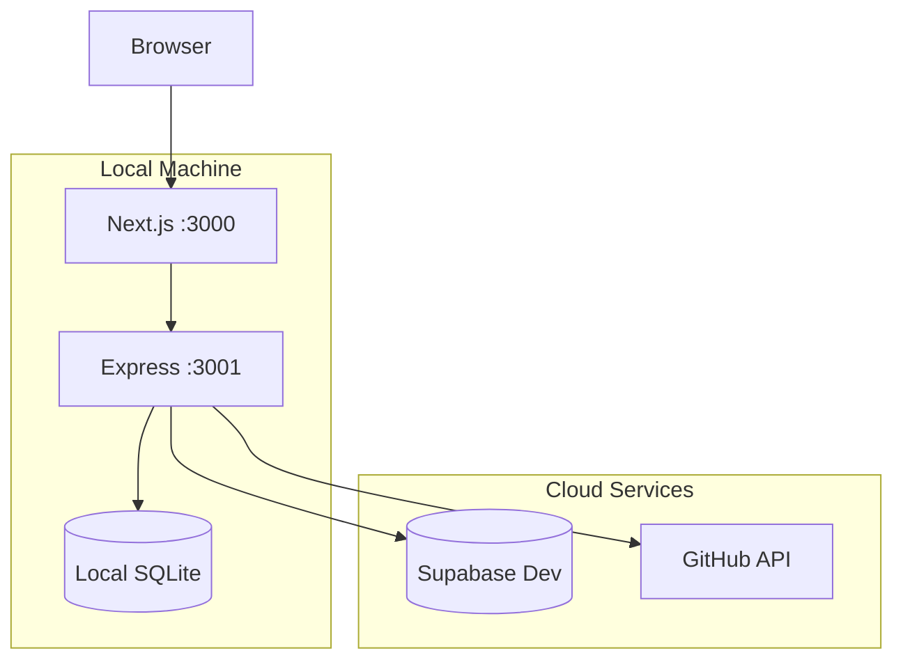

# Deployment Workflows

This document details the CI/CD pipelines, infrastructure setup, and deployment procedures for the Lawless AI platform.

## Table of Contents

- [Infrastructure Overview](#infrastructure-overview)
- [CI/CD Pipelines](#cicd-pipelines)
- [Frontend Deployment (Vercel)](#frontend-deployment-vercel)
- [Backend Deployment (Oracle Cloud)](#backend-deployment-oracle-cloud)
- [Database Migrations](#database-migrations)
- [Environment Configuration](#environment-configuration)
- [Monitoring and Rollback](#monitoring-and-rollback)
- [Local Development Setup](#local-development-setup)

---

## Infrastructure Overview

### Production Architecture



### Infrastructure Components

| Component | Provider | Purpose |
|-----------|----------|---------|
| Frontend | Vercel | Next.js hosting, serverless functions, CDN |
| Backend | Oracle Cloud | Express server, terminal sessions, workspaces |
| Database | Supabase | PostgreSQL, authentication, real-time |
| CI/CD | GitHub Actions | Automated deployments, code review |
| Source Control | GitHub | Repository hosting |

---

## CI/CD Pipelines

### Pipeline Overview

```mermaid
graph LR
    subgraph "Triggers"
        Push[Push to main]
        PR[Pull Request]
        Mention[@claude mention]
    end

    subgraph "GitHub Actions"
        Backend[Deploy Backend]
        Validate[Validate Marketplace]
        Claude[Claude Code Review]
    end

    subgraph "Vercel"
        Preview[Preview Deploy]
        Production[Production Deploy]
    end

    Push -->|backend/**| Backend
    Push --> Production
    PR --> Preview
    PR --> Validate
    Mention --> Claude
```

### Available Workflows

| Workflow | File | Trigger | Purpose |
|----------|------|---------|---------|
| Deploy Backend | `deploy-backend.yml` | Push to `main` in `backend/**` | Deploy Express server |
| Validate Marketplace | `validate-marketplace.yml` | Push/PR | Validate plugin manifest |
| Claude Code Review | `claude.yml` | `@claude` mention | AI code review |

---

## Frontend Deployment (Vercel)

### Automatic Deployments

Vercel automatically deploys on:
- **Production**: Push to `main` branch
- **Preview**: Pull request opened/updated

### Vercel Configuration

```json
// vercel.json
{
  "functions": {
    "app/api/projects/create/*.ts": {
      "maxDuration": 300
    },
    "app/api/**/*.ts": {
      "maxDuration": 60
    }
  },
  "headers": [
    {
      "source": "/(.*)",
      "headers": [
        {
          "key": "X-Frame-Options",
          "value": "SAMEORIGIN"
        },
        {
          "key": "Content-Security-Policy",
          "value": "frame-ancestors 'self' https://*.vercel.app localhost:*"
        }
      ]
    }
  ]
}
```

### Deployment Flow



### Build Configuration

```bash
# Build command
npm run build

# Output directory
.next

# Node version
20.x

# Install command
npm install
```

### Environment Variables (Vercel)

| Variable | Purpose |
|----------|---------|
| `NEXT_PUBLIC_BACKEND_URL` | Backend worker URL |
| `BACKEND_API_KEY` | API authentication |
| `NEXT_PUBLIC_SUPABASE_URL` | Supabase project URL |
| `NEXT_PUBLIC_SUPABASE_ANON_KEY` | Supabase public key |
| `SUPABASE_SERVICE_ROLE_KEY` | Supabase admin key |
| `GITHUB_CLIENT_ID` | OAuth app ID |
| `GITHUB_CLIENT_SECRET` | OAuth app secret |
| `ENCRYPTION_KEY` | Token encryption |
| `VERCEL_TOKEN` | Vercel API access |

---

## Backend Deployment (Oracle Cloud)

### Deployment Workflow

```yaml
# .github/workflows/deploy-backend.yml
name: Deploy Backend

on:
  push:
    branches:
      - main
    paths:
      - 'backend/**'

jobs:
  deploy:
    runs-on: ubuntu-latest
    steps:
      - name: Deploy to Oracle Cloud
        uses: appleboy/ssh-action@v1.2.4
        with:
          host: ${{ secrets.ORACLE_HOST }}
          username: ubuntu
          key: ${{ secrets.ORACLE_SSH_KEY }}
          script: |
            cd ~/lawless-ai/backend
            git pull origin main
            npm run build
            pm2 restart lawless-backend
            echo "Backend deployed successfully"
```

### Deployment Flow



### Server Setup

```bash
# Initial server setup (one-time)

# 1. Install Node.js 20
curl -fsSL https://deb.nodesource.com/setup_20.x | sudo -E bash -
sudo apt-get install -y nodejs

# 2. Install PM2
sudo npm install -g pm2

# 3. Clone repository
cd ~
git clone https://github.com/Light-Brands/lawless-ai.git
cd lawless-ai/backend

# 4. Install dependencies
npm install

# 5. Build
npm run build

# 6. Create .env file
cp .env.example .env
# Edit .env with production values

# 7. Start with PM2
pm2 start ecosystem.config.js
pm2 save
pm2 startup
```

### PM2 Configuration

```javascript
// backend/ecosystem.config.js
module.exports = {
  apps: [{
    name: 'lawless-backend',
    script: 'dist/server.js',
    instances: 1,
    autorestart: true,
    watch: false,
    max_memory_restart: '1G',
    env: {
      NODE_ENV: 'production',
      PORT: 3001
    }
  }]
};
```

### Backend Environment Variables

```bash
# backend/.env.example
PORT=3001
BACKEND_API_KEY=your-api-key
FRONTEND_URL=https://lawless-ai.vercel.app
DB_PATH=./data/conversations.db
WORKSPACE_DIR=/home/ubuntu/workspaces
SUPABASE_URL=https://xxx.supabase.co
SUPABASE_SERVICE_KEY=eyJ...
SUPABASE_ANON_KEY=eyJ...
```

### Manual Deployment

```bash
# SSH into server
ssh ubuntu@147.224.217.154

# Navigate to backend
cd ~/lawless-ai/backend

# Pull latest changes
git pull origin main

# Install new dependencies (if any)
npm install

# Rebuild
npm run build

# Restart
pm2 restart lawless-backend

# Check logs
pm2 logs lawless-backend

# Monitor
pm2 monit
```

---

## Database Migrations

### Supabase Migrations



### Migration Files

```
supabase/migrations/
├── 20260119_activity_events.sql
├── 20260119_conversation_tracking.sql
├── 20260119_github_username_auth.sql
└── 20260119_user_preferences.sql
```

### Example Migration

```sql
-- supabase/migrations/20260119_conversation_tracking.sql

-- Add conversation_type column
ALTER TABLE public.conversations
ADD COLUMN IF NOT EXISTS conversation_type TEXT DEFAULT 'workspace';

-- Add metadata column
ALTER TABLE public.conversations
ADD COLUMN IF NOT EXISTS metadata JSONB DEFAULT '{}';

-- Add last_message_at for sorting
ALTER TABLE public.conversations
ADD COLUMN IF NOT EXISTS last_message_at TIMESTAMPTZ DEFAULT NOW();

-- Create indexes
CREATE INDEX IF NOT EXISTS idx_conversations_type
ON public.conversations(user_id, conversation_type);

CREATE INDEX IF NOT EXISTS idx_conversations_last_message
ON public.conversations(user_id, last_message_at DESC);

-- Create trigger for auto-updating last_message_at
CREATE OR REPLACE FUNCTION update_conversation_last_message_at()
RETURNS TRIGGER AS $$
BEGIN
  IF NEW.messages IS DISTINCT FROM OLD.messages THEN
    NEW.last_message_at = NOW();
  END IF;
  RETURN NEW;
END;
$$ LANGUAGE plpgsql;

CREATE TRIGGER update_conversations_last_message_at
  BEFORE UPDATE ON public.conversations
  FOR EACH ROW EXECUTE FUNCTION update_conversation_last_message_at();
```

### Running Migrations

```bash
# Install Supabase CLI
npm install -g supabase

# Link to project
supabase link --project-ref jnxfynvgkguaghhorsov

# Apply migrations
supabase db push

# Check migration status
supabase migration list
```

---

## Environment Configuration

### Configuration Hierarchy



### Full Environment Variable Reference

#### Frontend (Vercel)

| Variable | Required | Description |
|----------|----------|-------------|
| `NEXT_PUBLIC_BACKEND_URL` | Yes | Backend API URL |
| `BACKEND_API_KEY` | Yes | Backend authentication |
| `NEXT_PUBLIC_SUPABASE_URL` | Yes | Supabase project URL |
| `NEXT_PUBLIC_SUPABASE_ANON_KEY` | Yes | Supabase anonymous key |
| `SUPABASE_SERVICE_ROLE_KEY` | Yes | Supabase admin operations |
| `GITHUB_CLIENT_ID` | Yes | GitHub OAuth app ID |
| `GITHUB_CLIENT_SECRET` | Yes | GitHub OAuth secret |
| `ENCRYPTION_KEY` | Yes | 64-char hex for token encryption |
| `VERCEL_TOKEN` | No | Vercel API access |

#### Backend (Oracle Cloud)

| Variable | Required | Description |
|----------|----------|-------------|
| `PORT` | No | Server port (default: 3001) |
| `BACKEND_API_KEY` | Yes | API key for authentication |
| `FRONTEND_URL` | Yes | Allowed CORS origin |
| `DB_PATH` | No | SQLite database path |
| `WORKSPACE_DIR` | No | Workspace root directory |
| `SUPABASE_URL` | No | Supabase project URL |
| `SUPABASE_SERVICE_KEY` | No | Supabase service role key |
| `SUPABASE_ANON_KEY` | No | Supabase anonymous key |

#### GitHub Actions Secrets

| Secret | Used By | Purpose |
|--------|---------|---------|
| `ORACLE_HOST` | deploy-backend | SSH host address |
| `ORACLE_SSH_KEY` | deploy-backend | SSH private key |
| `ANTHROPIC_API_KEY` | claude.yml | Claude API access |

---

## Monitoring and Rollback

### Health Monitoring

```mermaid
graph TB
    subgraph "Monitoring Points"
        VercelHealth[Vercel Dashboard]
        BackendHealth[/health endpoint]
        PM2Monit[PM2 Monitor]
        SupabaseLogs[Supabase Logs]
    end

    subgraph "Alerts"
        Email[Email Notifications]
        Slack[Slack Alerts]
    end

    VercelHealth --> Email
    BackendHealth --> Slack
    PM2Monit --> Slack
```

### Health Check Commands

```bash
# Check backend health
curl http://147.224.217.154:3001/health

# Check backend version
curl http://147.224.217.154:3001/version

# Check PM2 status
pm2 status

# View PM2 logs
pm2 logs lawless-backend --lines 100

# Monitor PM2
pm2 monit
```

### Rollback Procedures

#### Frontend Rollback (Vercel)



1. Go to Vercel Dashboard
2. Navigate to Deployments
3. Find last working deployment
4. Click "..." → "Promote to Production"

#### Backend Rollback

```bash
# SSH into server
ssh ubuntu@147.224.217.154

# Navigate to repo
cd ~/lawless-ai

# Find previous commit
git log --oneline -10

# Checkout previous version
git checkout <commit-hash>

# Rebuild and restart
cd backend
npm run build
pm2 restart lawless-backend
```

---

## Local Development Setup

### Prerequisites

- Node.js 20+
- Git
- GitHub account with OAuth app
- Supabase account (optional)

### Quick Start

```bash
# 1. Clone repository
git clone https://github.com/Light-Brands/lawless-ai.git
cd lawless-ai

# 2. Install frontend dependencies
npm install

# 3. Install backend dependencies
cd backend && npm install && cd ..

# 4. Configure environment
cp .env.example .env.local
# Edit .env.local with your values

cp backend/.env.example backend/.env
# Edit backend/.env with your values

# 5. Start backend (Terminal 1)
cd backend && npm run dev

# 6. Start frontend (Terminal 2)
npm run dev

# 7. Open browser
open http://localhost:3000
```

### Development Environment



### Development Scripts

```json
// package.json
{
  "scripts": {
    "dev": "next dev",
    "build": "next build",
    "start": "next start",
    "lint": "next lint",
    "typecheck": "tsc --noEmit"
  }
}

// backend/package.json
{
  "scripts": {
    "dev": "tsx watch src/server.ts",
    "build": "tsc",
    "start": "node dist/server.js"
  }
}
```

### Development vs Production

| Aspect | Development | Production |
|--------|-------------|------------|
| Frontend URL | localhost:3000 | lawless-ai.vercel.app |
| Backend URL | localhost:3001 | 147.224.217.154:3001 |
| Database | Local SQLite | SQLite + Supabase |
| Hot Reload | Yes | No |
| API Key | Optional | Required |
| CORS | Permissive | Restricted |

---

## Deployment Checklist

### Pre-Deployment

- [ ] All tests passing
- [ ] No TypeScript errors
- [ ] Environment variables configured
- [ ] Database migrations tested

### Deployment

- [ ] Push to main branch
- [ ] Verify Vercel deployment
- [ ] Verify backend deployment (if changed)
- [ ] Check health endpoints

### Post-Deployment

- [ ] Verify production functionality
- [ ] Check error logs
- [ ] Monitor performance
- [ ] Update documentation if needed

---

## Next Steps

- [Market Positioning](./market-positioning.md)
- [System Architecture](./architecture.md)
