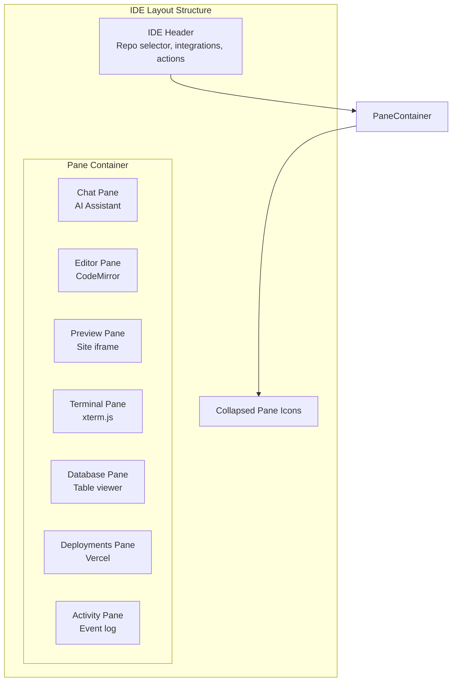
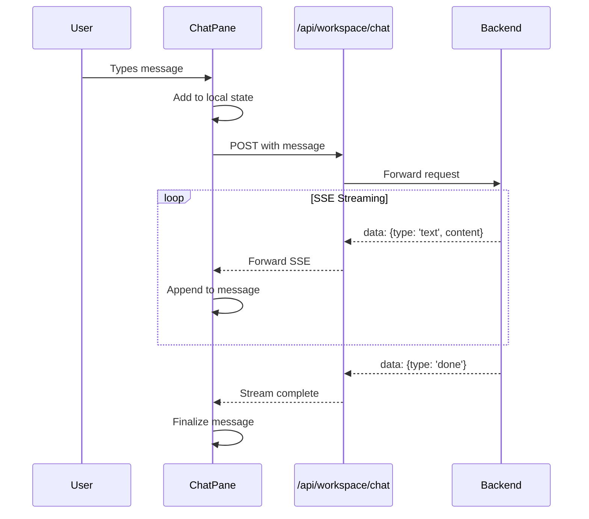
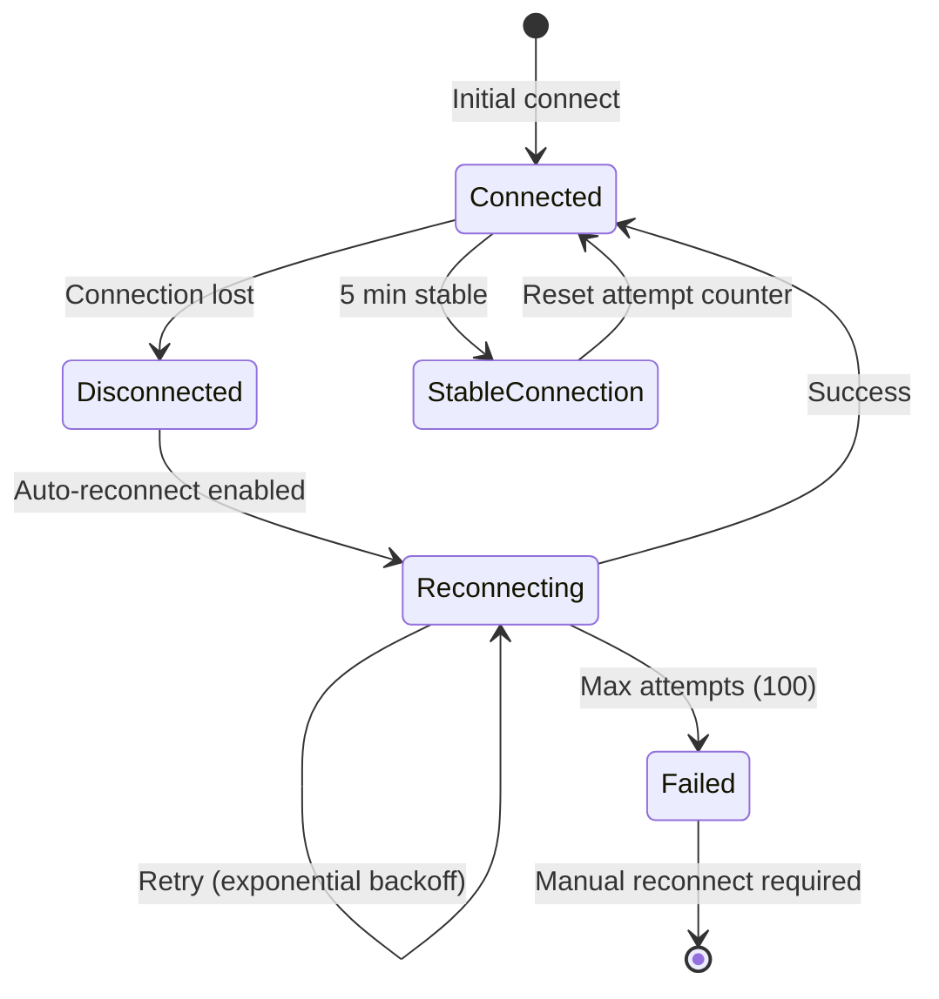
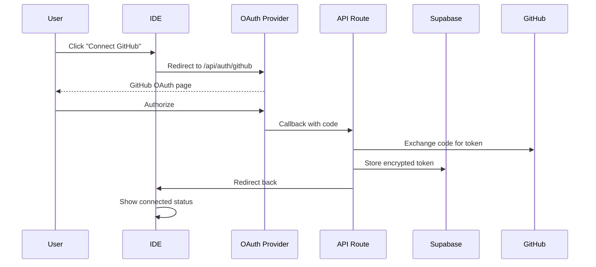

# Local IDE Deployment

This document covers the Lawless AI IDE interface, including the web-based IDE, pane components, state management, and the local development agent package.

## Table of Contents

- [IDE Overview](#ide-overview)
- [Pane Architecture](#pane-architecture)
- [State Management](#state-management)
- [Component Deep-Dive](#component-deep-dive)
- [Terminal Integration](#terminal-integration)
- [Local IDE Agent Package](#local-ide-agent-package)
- [Keyboard Shortcuts](#keyboard-shortcuts)
- [Service Integrations](#service-integrations)

---

## IDE Overview

The Lawless AI IDE is a web-based development environment built with Next.js 14 that provides:

- **Multi-pane layout**: Resizable panels for different tools
- **AI Chat**: Claude-powered code assistance
- **Code Editor**: CodeMirror-based file editing
- **Terminal**: Full PTY terminal via WebSocket
- **Preview**: Live site preview iframe
- **Database**: Supabase table viewer and SQL editor
- **Deployments**: Vercel deployment management



### IDE Routes

| Route | Purpose |
|-------|---------|
| `/ide` | Landing page with repo selector |
| `/ide/[owner]/[repo]` | Full IDE for specific repository |

---

## Pane Architecture

### Pane Configuration

```typescript
// app/ide/components/IDELayout.tsx
const PANE_CONFIG = {
  1: { title: 'AI Chat', icon: <ChatIcon />, component: ChatPane, defaultSize: 20, minSize: 15 },
  2: { title: 'Editor', icon: <CodeIcon />, component: EditorPane, defaultSize: 35, minSize: 20 },
  3: { title: 'Preview', icon: <GlobeIcon />, component: PreviewPane, defaultSize: 25, minSize: 15 },
  4: { title: 'Database', icon: <DatabaseIcon />, component: DatabasePane, defaultSize: 20, minSize: 15 },
  5: { title: 'Deployments', icon: <RocketIcon />, component: DeploymentsPane, defaultSize: 20, minSize: 15 },
  6: { title: 'Activity', icon: <ActivityIcon />, component: ActivityPane, defaultSize: 18, minSize: 12 },
  7: { title: 'Terminal', icon: <TerminalIcon />, component: TerminalPane, defaultSize: 30, minSize: 15 },
};
```

### Pane Visibility System

```mermaid
graph TB
    subgraph "Pane State"
        Order[paneOrder: number[]]
        Visibility[paneVisibility: Record<number, boolean>]
    end

    subgraph "Rendering"
        Visible[Visible Panes<br/>Rendered in PanelGroup]
        Collapsed[Collapsed Panes<br/>Icon bar on left]
        Hidden[Hidden Content<br/>Portal holders]
    end

    subgraph "Portal System"
        Holder[Pane Content Holder]
        Target[Portal Target<br/>In visible panel]
    end

    Order --> Visible
    Order --> Collapsed
    Visibility --> Visible
    Visibility --> Collapsed
    Holder -->|Portal when visible| Target
```

### Portal-Based Content Persistence

The IDE uses React portals to prevent component unmounting when panes are collapsed:

```typescript
// All pane content rendered ONCE in consistent order
<div className="pane-content-holder">
  {paneOrder.map((paneId) => (
    <PaneContentPortal paneId={paneId} isVisible={paneVisibility[paneId]}>
      <PaneComponent />
    </PaneContentPortal>
  ))}
</div>

// When visible, content portals to panel target
function PaneContentPortal({ paneId, isVisible, children }) {
  const { targets } = useContext(PanePortalContext);
  if (isVisible && targets[paneId]) {
    return createPortal(children, targets[paneId]);
  }
  return <>{children}</>;
}
```

### Resizable Panels

Using `react-resizable-panels` for smooth resizing:

```typescript
<PanelGroup orientation="horizontal" className="panes-container">
  {visiblePanes.map((paneId, index) => (
    <Fragment key={paneId}>
      <Panel
        id={`pane-${paneId}`}
        defaultSize={getDefaultSize(paneId)}
        minSize={config.minSize}
      >
        <PaneContainer
          id={paneId}
          title={config.title}
          onCollapse={() => togglePane(paneId)}
        >
          <PanePortalTarget paneId={paneId} />
        </PaneContainer>
      </Panel>

      {index < visiblePanes.length - 1 && (
        <PanelResizeHandle className="resize-handle" />
      )}
    </Fragment>
  ))}
</PanelGroup>
```

---

## State Management

### IDE Store (Zustand)

```typescript
// app/ide/stores/ideStore.ts
interface IDEState {
  // Pane management
  paneOrder: number[];
  paneVisibility: Record<number, boolean>;
  maxPanesReached: boolean;

  // Actions
  togglePane: (paneId: number) => void;
  reorderPanes: (newOrder: number[]) => void;
  setMaxPanesReached: (reached: boolean) => void;
}

const MAX_VISIBLE_PANES = 5;

export const useIDEStore = create<IDEState>((set, get) => ({
  paneOrder: [1, 2, 3, 7],  // Chat, Editor, Preview, Terminal
  paneVisibility: { 1: true, 2: true, 3: true, 4: false, 5: false, 6: false, 7: true },

  togglePane: (paneId) => {
    const { paneVisibility } = get();
    const currentlyVisible = paneVisibility[paneId];

    if (!currentlyVisible) {
      // Check max panes limit
      const visibleCount = Object.values(paneVisibility).filter(Boolean).length;
      if (visibleCount >= MAX_VISIBLE_PANES) {
        set({ maxPanesReached: true });
        return;
      }
    }

    set({
      paneVisibility: { ...paneVisibility, [paneId]: !currentlyVisible }
    });
  },
}));
```

### IDE Context

```typescript
// app/ide/contexts/IDEContext.tsx
interface IDEContextValue {
  owner: string;
  repo: string;
  repoFullName: string;
  sessionId: string | null;
  workspaceSession: WorkspaceSession | null;
  setWorkspaceSession: (session: WorkspaceSession | null) => void;
}

export function IDEProvider({ owner, repo, sessionId, children }) {
  const [workspaceSession, setWorkspaceSession] = useState<WorkspaceSession | null>(null);

  return (
    <IDEContext.Provider value={{
      owner,
      repo,
      repoFullName: `${owner}/${repo}`,
      sessionId,
      workspaceSession,
      setWorkspaceSession,
    }}>
      {children}
    </IDEContext.Provider>
  );
}
```

### Service Context

```typescript
// app/ide/contexts/ServiceContext.tsx
interface ServiceContextValue {
  terminal: {
    wsUrl: string | null;
    isConnected: boolean;
  };
  supabase: {
    isConnected: boolean;
    projectRef: string | null;
  };
  vercel: {
    isConnected: boolean;
    projectId: string | null;
  };
  github: {
    isConnected: boolean;
    token: string | null;
  };
}
```

---

## Component Deep-Dive

### Chat Pane

The AI chat interface with streaming responses:



Features:
- Markdown rendering with syntax highlighting
- Mermaid diagram support
- Tool use visualization
- Thinking/reasoning display
- Conversation history

### Terminal Pane

Full PTY terminal with xterm.js:

```typescript
// Terminal initialization
const term = new Terminal({
  cursorBlink: true,
  fontSize: 14,
  fontFamily: '"JetBrains Mono", "Fira Code", monospace',
  scrollback: 10000,
  theme: {
    background: '#0d1117',
    foreground: '#c9d1d9',
    cursor: '#58a6ff',
    // ... GitHub dark theme colors
  }
});

const fit = new FitAddon();
const webLinks = new WebLinksAddon();

term.loadAddon(fit);
term.loadAddon(webLinks);
term.open(containerElement);
```

### Editor Pane

CodeMirror 6 file editor:

- File tree navigation
- Syntax highlighting
- Multiple file tabs
- Auto-save (debounced)
- Git status indicators

### Preview Pane

Live site preview:

```typescript
<iframe
  src={previewUrl}
  sandbox="allow-scripts allow-same-origin allow-forms"
  referrerPolicy="no-referrer"
/>
```

Features:
- Auto-refresh on deployment
- URL navigation
- Mobile/desktop viewport toggle

### Database Pane

Supabase integration:

- Table listing
- Row browser with pagination
- SQL query editor
- Schema viewer

### Deployments Pane

Vercel deployment management:

- Deployment history
- Build logs
- Redeploy trigger
- Environment variables

### Activity Pane

Event timeline:

- Chat interactions
- File changes
- Git operations
- Deployment events

---

## Terminal Integration

### useTerminal Hook

```typescript
// app/ide/hooks/useTerminal.ts
export function useTerminal(options: UseTerminalOptions): UseTerminalReturn {
  const {
    onConnected,
    onDisconnected,
    onError,
    onBranchInfo,
    autoReconnect = true,
    persistOutput = true,
  } = options;

  return {
    containerRef,           // Ref callback for terminal container
    isConnected,            // WebSocket connection status
    isInitialized,          // Terminal initialized
    isReconnecting,         // Auto-reconnect in progress
    reconnectAttempt,       // Current attempt number
    branchName,             // Git branch name
    connect,                // Manual connect
    disconnect,             // Manual disconnect
    restart,                // Restart Claude process
    sendInput,              // Send input to PTY
    sendKey,                // Send special key (Tab, Ctrl+C, etc.)
    clear,                  // Clear terminal
    fit,                    // Fit to container
    cancelReconnect,        // Cancel reconnection
  };
}
```

### Auto-Reconnect Logic



### Terminal Key Handling

```typescript
export const TERMINAL_KEYS = {
  TAB: '\t',
  ESCAPE: '\x1b',
  CTRL_C: '\x03',
  CTRL_D: '\x04',
  CTRL_Z: '\x1a',
  CTRL_L: '\x0c',
  ARROW_UP: '\x1b[A',
  ARROW_DOWN: '\x1b[B',
  ARROW_RIGHT: '\x1b[C',
  ARROW_LEFT: '\x1b[D',
  ENTER: '\r',
  BACKSPACE: '\x7f',
};
```

### Output Persistence

Terminal output is persisted across sessions:

```typescript
// Save output (debounced every 2 seconds)
const captureOutput = useCallback((data: string) => {
  outputHistoryRef.current = [
    ...outputHistoryRef.current,
    ...data.split('\n')
  ].slice(-MAX_HISTORY_LINES);

  // Debounced save to database
  clearTimeout(saveTimeout);
  saveTimeout = setTimeout(saveOutputToDatabase, 2000);
}, []);

// Load saved output on reconnect
const loadSavedOutput = async () => {
  const response = await fetch(`/api/terminal/output?sessionId=${sessionId}`);
  const data = await response.json();

  if (data.outputLines?.length > 0) {
    terminal.writeln('--- Restored previous session output ---');
    data.outputLines.slice(-50).forEach(line => terminal.writeln(line));
    terminal.writeln('--- End of restored output ---');
  }
};
```

---

## Local IDE Agent Package

### Package Overview

`@lawless-ai/local-ide-agent` allows developers to embed AI assistance in their local development:

```json
{
  "name": "@lawless-ai/local-ide-agent",
  "version": "0.1.0",
  "description": "Your website with AI built in. Full-screen preview with Claude in a collapsible drawer.",
  "main": "dist/index.js",
  "peerDependencies": {
    "next": ">=14.0.0",
    "react": ">=18.0.0"
  }
}
```

### Installation

```bash
npm install @lawless-ai/local-ide-agent
```

### Usage

```typescript
// app/layout.tsx
import { LawlessIDEProvider } from '@lawless-ai/local-ide-agent';

export default function RootLayout({ children }) {
  return (
    <html>
      <body>
        {children}
        {process.env.NODE_ENV === 'development' && <LawlessIDEProvider />}
      </body>
    </html>
  );
}
```

### Exported Components

| Component | Purpose |
|-----------|---------|
| `LawlessIDEProvider` | Main wrapper, renders drawer and inspector |
| `ClaudeDrawer` | Collapsible chat sidebar |
| `ElementInspector` | DOM element inspection tool |
| `useChat` | Chat state management hook |
| `useIDEStore` | Zustand store access |

### Package Structure

```
packages/local-ide-agent/
├── src/
│   └── index.tsx              # Main exports
├── .lawless/
│   ├── config/
│   │   └── services.json      # Service configuration
│   └── ide/
│       └── src/
│           ├── components/
│           │   ├── ChatDrawer/
│           │   └── ElementInspector/
│           ├── lib/
│           │   └── useChat.ts
│           └── stores/
│               └── ideStore.ts
└── package.json
```

### Configuration

```json
// .lawless/config/services.json
{
  "claude": {
    "apiKey": "ANTHROPIC_API_KEY",
    "model": "claude-sonnet-4-20250514",
    "maxTokens": 8096
  },
  "github": {
    "token": "GITHUB_TOKEN"
  },
  "supabase": {
    "url": "SUPABASE_URL",
    "anonKey": "SUPABASE_ANON_KEY",
    "serviceKey": "SUPABASE_SERVICE_KEY"
  },
  "vercel": {
    "token": "VERCEL_TOKEN"
  }
}
```

---

## Keyboard Shortcuts

| Shortcut | Action |
|----------|--------|
| `Cmd+1` | Toggle Chat pane |
| `Cmd+2` | Toggle Editor pane |
| `Cmd+3` | Toggle Preview pane |
| `Cmd+4` | Toggle Database pane |
| `Cmd+5` | Toggle Deployments pane |
| `Cmd+6` | Toggle Activity pane |
| `Cmd+7` | Toggle Terminal pane |
| `Cmd+K` | Open command palette |
| `Cmd+Enter` | Send chat message |

### Keyboard Hook

```typescript
// app/ide/hooks/useKeyboardShortcuts.ts
export function useKeyboardShortcuts() {
  const { togglePane } = useIDEStore();

  useEffect(() => {
    const handleKeyDown = (e: KeyboardEvent) => {
      if (e.metaKey || e.ctrlKey) {
        const key = parseInt(e.key);
        if (key >= 1 && key <= 7) {
          e.preventDefault();
          togglePane(key);
        }
      }
    };

    window.addEventListener('keydown', handleKeyDown);
    return () => window.removeEventListener('keydown', handleKeyDown);
  }, [togglePane]);
}
```

---

## Service Integrations

### GitHub Integration

- OAuth authentication
- Repository listing
- File contents API
- Branch management
- Commit/push operations

### Supabase Integration

- Project listing
- Table/schema viewer
- SQL query execution
- Row CRUD operations
- Real-time subscriptions

### Vercel Integration

- Project listing
- Deployment history
- Build logs
- Environment variables
- Redeploy triggers

### Integration Connection Flow



---

## Styling

### CSS Architecture

```
app/ide/styles/
├── index.css           # Main entry point
├── base.css            # Reset, variables, utilities
├── layout.css          # IDE layout structure
├── header.css          # Header component
├── landing.css         # Landing page
└── components/
    ├── command-palette.css
    ├── highlight.css
    ├── markdown.css
    ├── mermaid.css
    └── modals.css
└── panes/
    ├── activity.css
    ├── chat.css
    ├── database.css
    ├── deployments.css
    ├── editor.css
    └── preview.css
```

### Theme Variables

```css
:root {
  /* GitHub Dark Theme */
  --bg-primary: #0d1117;
  --bg-secondary: #161b22;
  --bg-tertiary: #21262d;
  --text-primary: #c9d1d9;
  --text-secondary: #8b949e;
  --accent-blue: #58a6ff;
  --accent-green: #3fb950;
  --accent-red: #f85149;
  --border-color: #30363d;
}
```

---

## Next Steps

- [Orchestration Layer](./orchestration.md)
- [Deployment Workflows](./deployment.md)
- [Market Positioning](./market-positioning.md)
