# Market Positioning

This document analyzes Lawless AI's position in the AI-assisted development tools market, including competitive analysis, differentiation strategy, and value proposition.

## Table of Contents

- [Market Overview](#market-overview)
- [Competitive Landscape](#competitive-landscape)
- [Product Positioning](#product-positioning)
- [Differentiation Strategy](#differentiation-strategy)
- [Target Segments](#target-segments)
- [Value Proposition](#value-proposition)
- [SWOT Analysis](#swot-analysis)
- [Go-to-Market Strategy](#go-to-market-strategy)

---

## Market Overview

### AI Development Tools Market

The AI-assisted development tools market is experiencing rapid growth, driven by:

- Increasing developer productivity demands
- Advancement in large language models (LLMs)
- Growing adoption of AI pair programming
- Shift toward cloud-based development environments

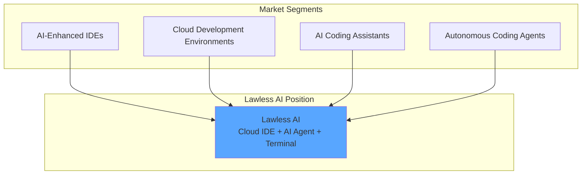

### Market Drivers

| Driver | Impact | Lawless AI Response |
|--------|--------|---------------------|
| Remote work normalization | High | Cloud-first architecture |
| AI model capabilities | High | Claude Code integration |
| Developer experience expectations | High | Unified multi-pane IDE |
| Enterprise security requirements | Medium | Session isolation, encrypted tokens |
| Tool fragmentation fatigue | Medium | All-in-one platform |

---

## Competitive Landscape

### Direct Competitors

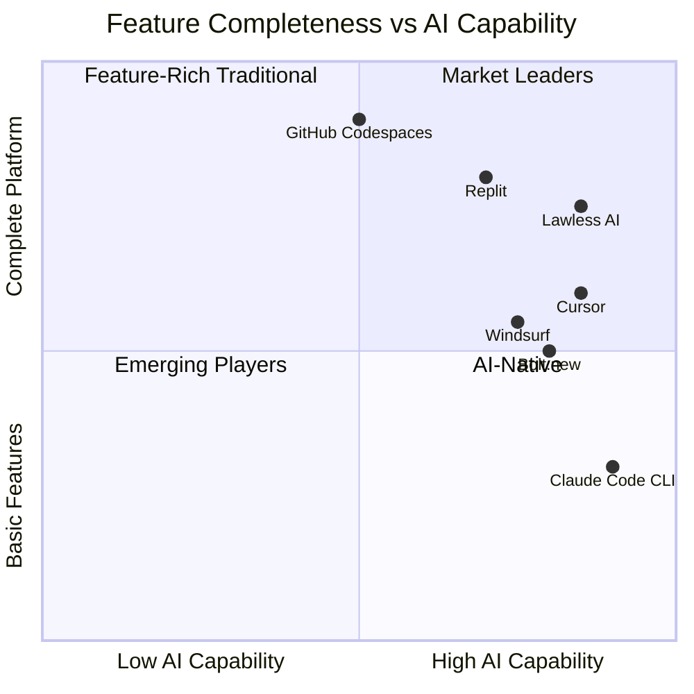

### Competitive Comparison Matrix

| Feature | Lawless AI | Replit | GitHub Codespaces | Cursor | Bolt.new | Claude Code |
|---------|------------|--------|-------------------|--------|----------|-------------|
| **Cloud IDE** | ✅ | ✅ | ✅ | ❌ | ✅ | ❌ |
| **AI Chat** | ✅ | ✅ | ✅ (Copilot) | ✅ | ✅ | ✅ |
| **Real Terminal** | ✅ | ✅ | ✅ | ✅ | ❌ | ✅ |
| **Git Worktrees** | ✅ | ❌ | ❌ | ❌ | ❌ | ✅ |
| **Session Isolation** | ✅ | ❌ | ❌ | ❌ | ❌ | ✅ |
| **Tool Use (Agentic)** | ✅ | ❌ | ❌ | ✅ | ✅ | ✅ |
| **Database Integration** | ✅ | ✅ | ❌ | ❌ | ✅ | ❌ |
| **Deployment Integration** | ✅ | ✅ | ❌ | ❌ | ✅ | ❌ |
| **Local Package** | ✅ | ❌ | ❌ | ✅ | ❌ | ✅ |
| **Free Tier** | ✅ | ✅ | ❌ | Limited | Limited | ✅ |

### Competitor Deep Dives

#### Replit

**Strengths:**
- Mature cloud IDE platform
- Strong educational market presence
- Built-in hosting and databases
- Large community

**Weaknesses:**
- AI capabilities less advanced
- No session/worktree isolation
- Limited professional tooling

#### Cursor

**Strengths:**
- Best-in-class AI integration
- Native VS Code experience
- Fast and responsive
- Strong developer following

**Weaknesses:**
- Desktop-only (no cloud)
- No built-in terminal sessions
- No deployment integration

#### GitHub Codespaces

**Strengths:**
- Tight GitHub integration
- Enterprise-grade security
- Full dev container support
- VS Code compatibility

**Weaknesses:**
- Expensive at scale
- AI limited to Copilot
- No agentic capabilities
- Complex setup

#### Bolt.new

**Strengths:**
- Rapid prototyping
- Clean, simple interface
- Deployment integration

**Weaknesses:**
- No real terminal
- Limited to web projects
- No session management

---

## Product Positioning

### Positioning Statement

**For** developers and teams who want AI-assisted development with full tooling,

**Lawless AI** is a cloud development platform

**That** combines Claude Code's agentic capabilities with a complete IDE experience including terminal, editor, database, and deployment tools.

**Unlike** Cursor (desktop-only), Replit (limited AI), or Bolt.new (no terminal),

**Lawless AI** provides session-isolated workspaces with real PTY terminals and integrated cloud services.

### Market Position Map

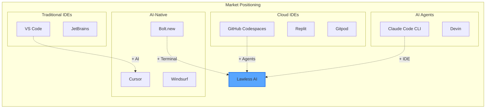

---

## Differentiation Strategy

### Primary Differentiators

#### 1. Session-Isolated Git Worktrees

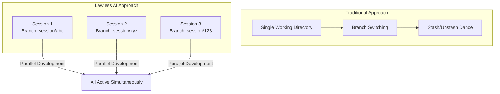

**Why it matters:** Developers can work on multiple features, experiments, or bugs simultaneously without context switching or branch management overhead.

#### 2. Real Terminal with WebSocket Streaming

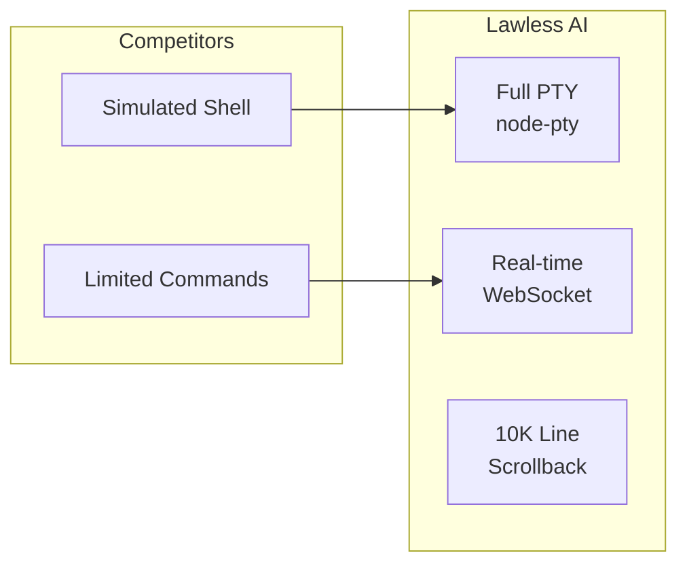

**Why it matters:** Full terminal access enables complex workflows, debugging, and tool usage that simulated terminals cannot support.

#### 3. Integrated Service Orchestration

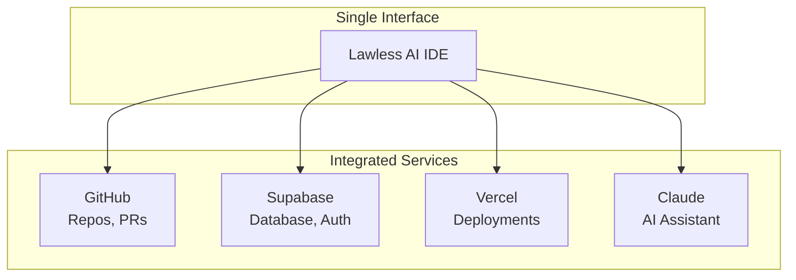

**Why it matters:** Eliminates context switching between multiple tools and dashboards.

#### 4. Local IDE Agent Package

```typescript
// Drop-in AI assistance for any Next.js project
import { LawlessIDEProvider } from '@lawless-ai/local-ide-agent';

// Instant AI capabilities in development
{process.env.NODE_ENV === 'development' && <LawlessIDEProvider />}
```

**Why it matters:** Extends platform value to local development without requiring full cloud adoption.

### Secondary Differentiators

| Differentiator | Description | Competitive Advantage |
|----------------|-------------|----------------------|
| Dual Persistence | SQLite + Supabase | Offline capability + cloud sync |
| Plugin System | Configurable commands/agents | Extensible AI behaviors |
| Auto-Reconnect | 100-attempt WebSocket retry | Long-running session support |
| Conversation History | Cross-session persistence | Context continuity |

---

## Target Segments

### Primary Segments

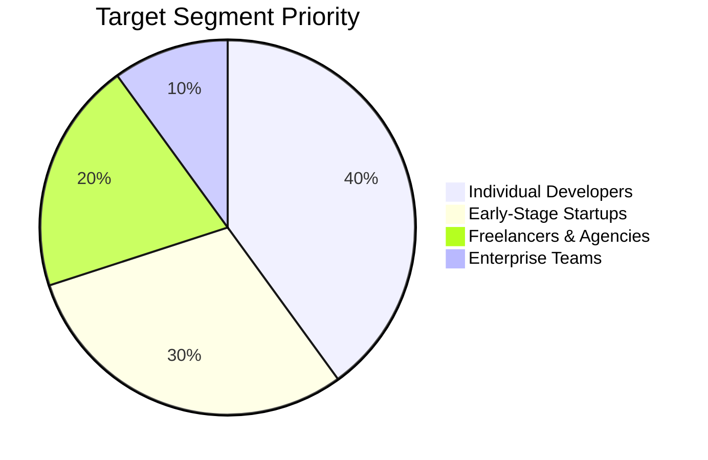

#### 1. Individual Developers (40%)

**Profile:**
- Building side projects or learning
- Want AI assistance without setup friction
- Price-sensitive
- Value speed over enterprise features

**Key Needs:**
- Quick project setup
- AI coding assistance
- Free or low-cost option
- Simple deployment

#### 2. Early-Stage Startups (30%)

**Profile:**
- Small engineering teams (1-5)
- Fast iteration requirements
- Budget-conscious
- Need to ship quickly

**Key Needs:**
- Collaborative development
- Integrated deployment
- Database management
- AI-accelerated development

#### 3. Freelancers & Agencies (20%)

**Profile:**
- Managing multiple client projects
- Need isolation between projects
- Value professional tooling
- Billable efficiency matters

**Key Needs:**
- Project isolation (worktrees)
- Professional terminal access
- Quick context switching
- Client-ready deployment

#### 4. Enterprise Teams (10%)

**Profile:**
- Larger teams with compliance needs
- Require security and audit trails
- Custom deployment requirements
- Integration with existing tools

**Key Needs:**
- SSO/SAML integration
- Audit logging
- Self-hosted option
- Enterprise support

---

## Value Proposition

### Core Value Proposition

```
"Ship faster with AI that actually understands your codebase."

Lawless AI combines Claude's agentic coding capabilities with a complete
cloud development environment—terminal, editor, database, and deployments—
in one unified interface.
```

### Value Proposition Canvas

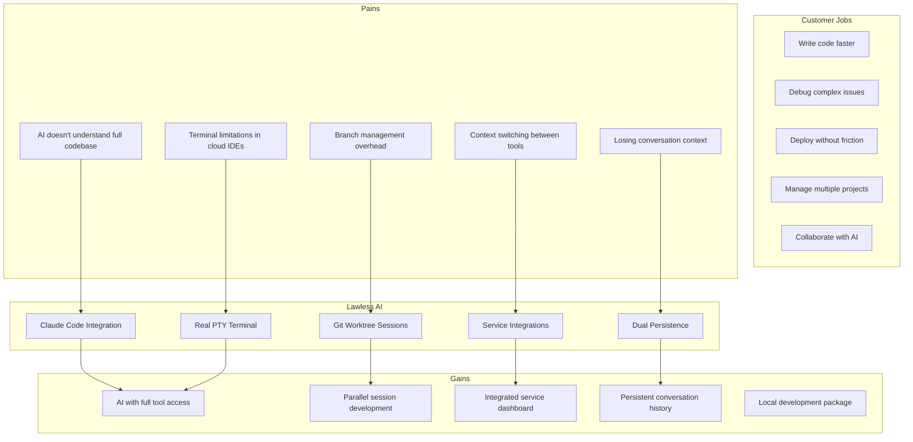

### ROI Arguments

| Metric | Before Lawless AI | After Lawless AI | Improvement |
|--------|-------------------|------------------|-------------|
| Context switches/day | 50+ | 10-15 | 70% reduction |
| Time to first commit | 30+ min | 5 min | 6x faster |
| AI interaction quality | Generic | Codebase-aware | Qualitative |
| Tool setup time | Hours | Minutes | 90% reduction |

---

## SWOT Analysis

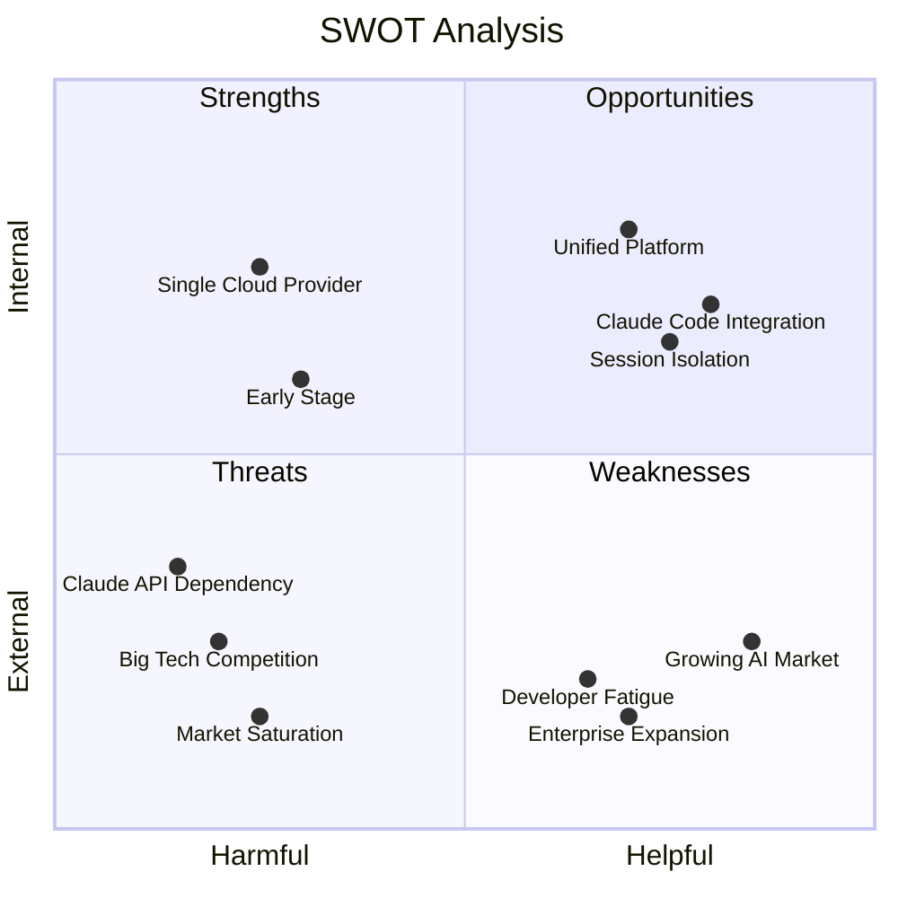

### Strengths

- **Claude Code Integration**: Best-in-class agentic AI capabilities
- **Session Isolation**: Unique git worktree-based architecture
- **Unified Platform**: Complete development environment
- **Developer-First Design**: Professional tooling without compromise
- **Open Source Heritage**: Plugin system from ai-coding-config

### Weaknesses

- **Single Cloud Provider**: Dependent on Oracle Cloud for backend
- **Early Stage**: Limited user base and brand recognition
- **Resource Constraints**: Small team for development velocity
- **Enterprise Features**: Limited audit, compliance, SSO

### Opportunities

- **Growing AI Market**: Rapidly expanding developer AI adoption
- **Developer Fatigue**: Frustration with tool fragmentation
- **Enterprise Expansion**: Large market with premium pricing
- **Local IDE Package**: Distribution channel for platform growth
- **Education Market**: Coding bootcamps and universities

### Threats

- **Big Tech Competition**: GitHub, Google, Amazon resources
- **Claude API Dependency**: Anthropic pricing or policy changes
- **Market Saturation**: Crowded AI coding assistant space
- **Open Source Alternatives**: Free alternatives gaining traction
- **Economic Downturn**: Reduced developer tool spending

---

## Go-to-Market Strategy

### Launch Strategy

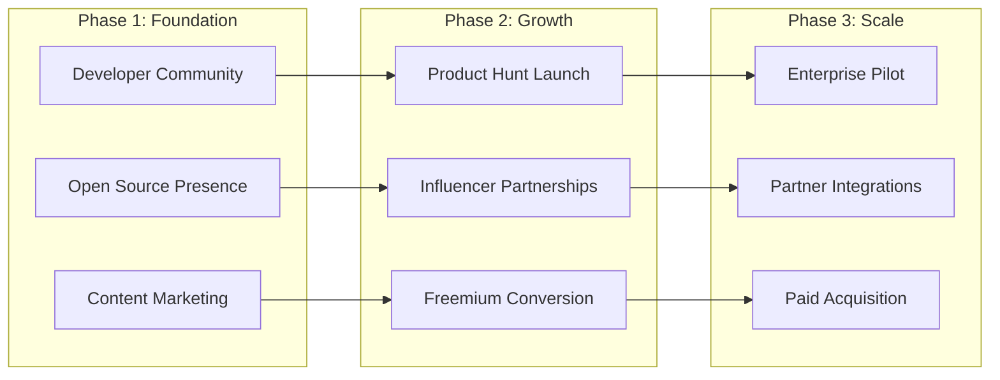

### Distribution Channels

| Channel | Strategy | Expected Impact |
|---------|----------|-----------------|
| Organic Search | SEO for "AI coding assistant", "cloud IDE" | Long-term traffic |
| Developer Communities | Reddit, HN, Discord, Twitter/X | Early adopters |
| Content Marketing | Tutorials, comparisons, use cases | Authority building |
| Local IDE Package | NPM distribution | Viral adoption |
| Plugin Marketplace | Claude Code marketplace | Platform integration |

### Pricing Strategy (Proposed)

| Tier | Price | Features |
|------|-------|----------|
| **Free** | $0/month | 100 AI messages/day, 2 sessions, community support |
| **Pro** | $20/month | Unlimited messages, 10 sessions, priority support |
| **Team** | $50/user/month | Collaboration, shared workspaces, admin controls |
| **Enterprise** | Custom | SSO, audit logs, SLA, dedicated support |

### Success Metrics

| Metric | Target (6 months) | Target (12 months) |
|--------|-------------------|---------------------|
| Monthly Active Users | 1,000 | 10,000 |
| Paid Conversions | 5% | 8% |
| NPS Score | 40+ | 50+ |
| Retention (30-day) | 40% | 50% |
| GitHub Stars | 500 | 2,000 |

---

## Competitive Moat Strategy

### Building Defensibility

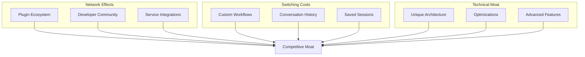

### Defensibility Priorities

1. **Plugin Ecosystem**: Enable community-built extensions
2. **Data Gravity**: Make conversation history invaluable
3. **Integration Depth**: Deep service integrations hard to replicate
4. **Developer Love**: Community advocacy and word-of-mouth
5. **Technical Innovation**: Stay ahead on session isolation and AI features

---

## Next Steps

- [System Architecture](./architecture.md)
- [Deployment Workflows](./deployment.md)
