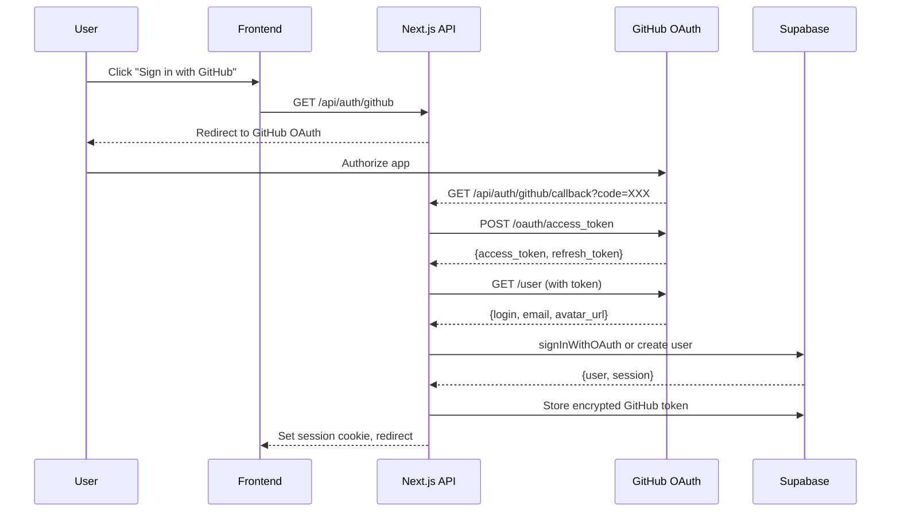
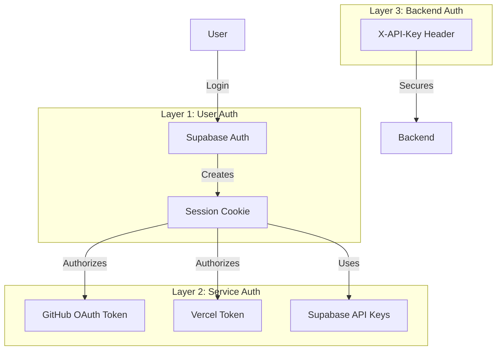
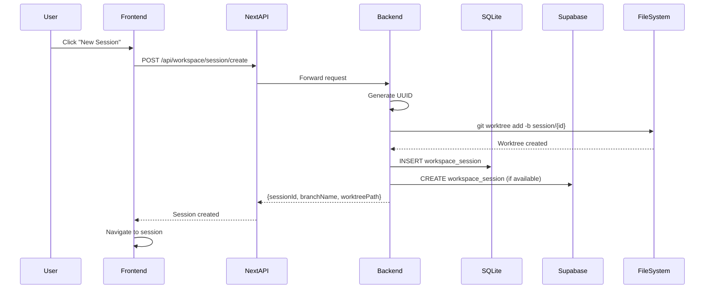
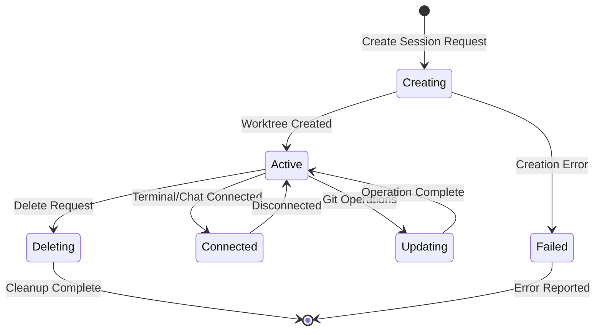
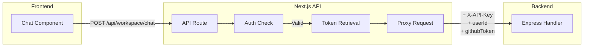
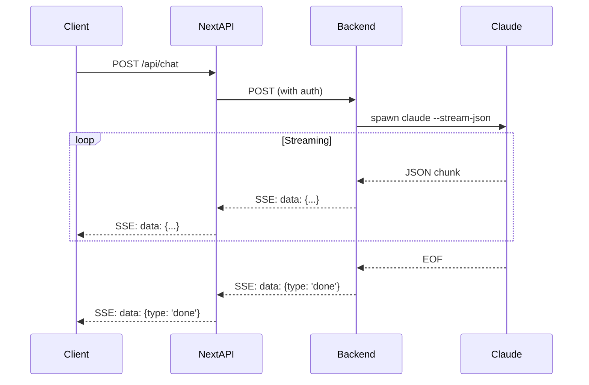
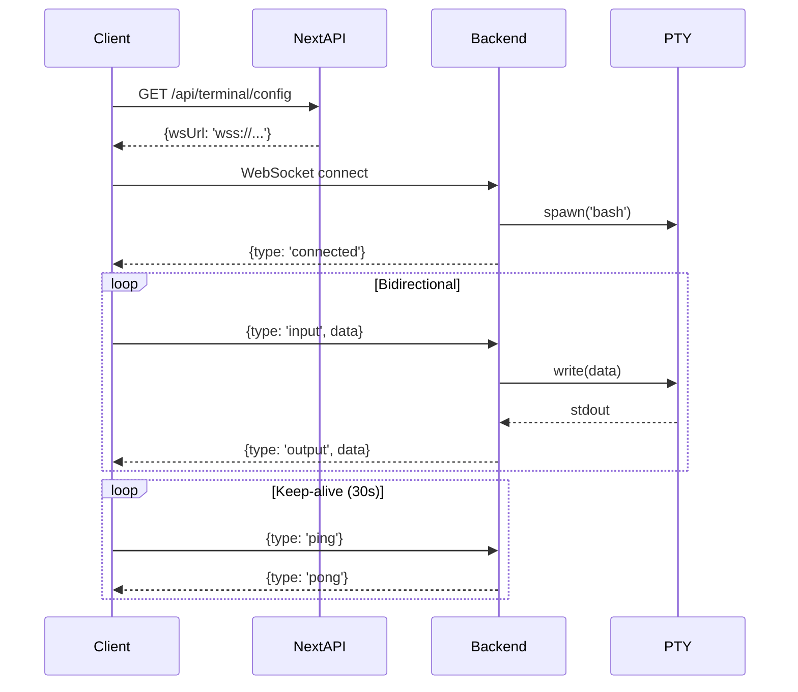
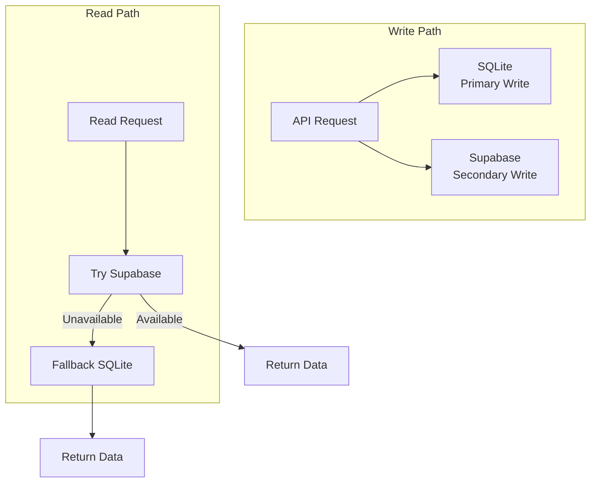
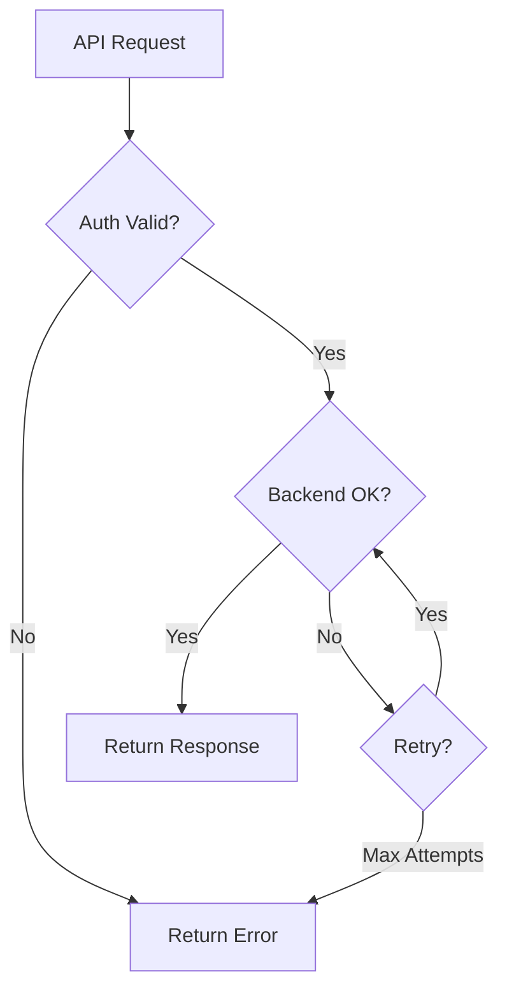
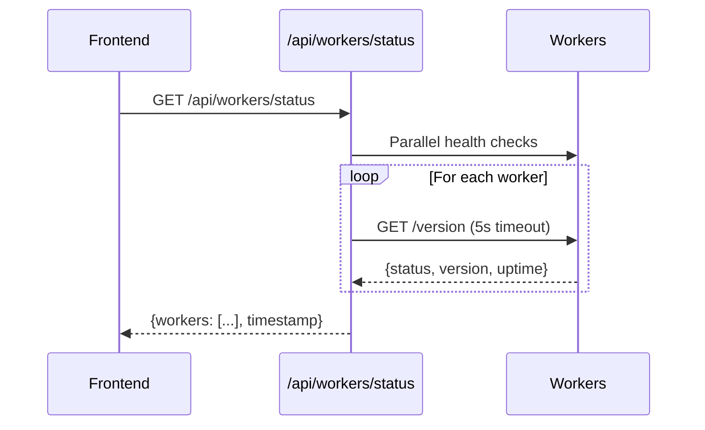

# Orchestration Layer

This document details how the Lawless AI system orchestrates requests between the frontend, backend workers, and external services, including authentication, session management, and data flow patterns.

## Table of Contents

- [Request Routing](#request-routing)
- [Authentication Flow](#authentication-flow)
- [Session Management](#session-management)
- [API Proxy Layer](#api-proxy-layer)
- [Real-time Communication](#real-time-communication)
- [Data Persistence Strategy](#data-persistence-strategy)
- [Error Handling](#error-handling)
- [Rate Limiting and Quotas](#rate-limiting-and-quotas)

---

## Request Routing

### High-Level Request Flow

```mermaid
graph TB
    subgraph "Client"
        Browser[Web Browser]
    end

    subgraph "Vercel Edge"
        CDN[CDN / Static Assets]
        SSR[Next.js SSR]
    end

    subgraph "Next.js API Routes"
        AuthRoutes[/api/auth/*]
        ChatRoutes[/api/chat, /api/workspace/chat]
        WorkspaceRoutes[/api/workspace/*]
        TerminalRoutes[/api/terminal/*]
        IntegrationRoutes[/api/integrations/*]
    end

    subgraph "Backend Workers"
        Worker1[Oracle Primary<br/>147.224.217.154:3001]
    end

    subgraph "External Services"
        Supabase[(Supabase)]
        GitHub[GitHub API]
        Vercel[Vercel API]
        Anthropic[Anthropic API]
    end

    Browser -->|Static| CDN
    Browser -->|Dynamic| SSR
    Browser -->|API| AuthRoutes
    Browser -->|API| ChatRoutes
    Browser -->|API| WorkspaceRoutes
    Browser -->|API| TerminalRoutes
    Browser -->|API| IntegrationRoutes

    AuthRoutes --> Supabase
    AuthRoutes --> GitHub
    ChatRoutes --> Worker1
    WorkspaceRoutes --> Worker1
    TerminalRoutes --> Worker1
    IntegrationRoutes --> Supabase
    IntegrationRoutes --> GitHub
    IntegrationRoutes --> Vercel
    Worker1 --> Anthropic
    Worker1 --> Supabase
```

### Route Categories

| Category | Routes | Backend Required | Description |
|----------|--------|------------------|-------------|
| Auth | `/api/auth/*` | No | OAuth flows, session management |
| Chat | `/api/chat`, `/api/workspace/chat` | Yes | AI chat with SSE streaming |
| Workspace | `/api/workspace/*` | Yes | Repo setup, sessions, git ops |
| Terminal | `/api/terminal/*` | Yes | Terminal config and sessions |
| Integrations | `/api/integrations/*` | No | Supabase, Vercel, GitHub APIs |
| User | `/api/user/*` | No | User preferences and repos |

---

## Authentication Flow

### OAuth Authentication Architecture



### Token Storage

GitHub tokens are encrypted before storage in Supabase:

```typescript
// lib/encryption.ts
import crypto from 'crypto';

const ENCRYPTION_KEY = process.env.ENCRYPTION_KEY;
const ALGORITHM = 'aes-256-gcm';

export function encrypt(text: string): string {
  const iv = crypto.randomBytes(16);
  const cipher = crypto.createCipheriv(ALGORITHM, Buffer.from(ENCRYPTION_KEY, 'hex'), iv);
  let encrypted = cipher.update(text, 'utf8', 'hex');
  encrypted += cipher.final('hex');
  const authTag = cipher.getAuthTag();
  return `${iv.toString('hex')}:${authTag.toString('hex')}:${encrypted}`;
}

export function decrypt(encryptedText: string): string {
  const [ivHex, authTagHex, encrypted] = encryptedText.split(':');
  const decipher = crypto.createDecipheriv(
    ALGORITHM,
    Buffer.from(ENCRYPTION_KEY, 'hex'),
    Buffer.from(ivHex, 'hex')
  );
  decipher.setAuthTag(Buffer.from(authTagHex, 'hex'));
  let decrypted = decipher.update(encrypted, 'hex', 'utf8');
  decrypted += decipher.final('utf8');
  return decrypted;
}
```

### API Key Authentication (Backend)

```typescript
// Backend middleware
const authenticateApiKey = (req: Request, res: Response, next: NextFunction) => {
  const apiKey = req.headers['x-api-key'];
  const expectedKey = process.env.BACKEND_API_KEY;

  // Skip auth if no key configured (development)
  if (!expectedKey) {
    return next();
  }

  if (apiKey !== expectedKey) {
    res.status(401).json({ error: 'Unauthorized' });
    return;
  }
  next();
};
```

### Authentication Layers



---

## Session Management

### Session Types

| Session Type | Purpose | Storage | Lifecycle |
|--------------|---------|---------|-----------|
| User Session | Authentication | Supabase Auth + Cookie | Until logout/expiry |
| Workspace Session | Isolated git worktree | SQLite + Supabase | Until deleted |
| Terminal Session | PTY connection | In-memory + SQLite | Until disconnect |
| Conversation | Chat history | SQLite + Supabase | Persistent |

### Workspace Session Flow



### Session State Machine



### Session Restoration

When a user returns to an existing session:

```typescript
// Frontend: Check for existing session
const response = await fetch(`/api/workspace/session/${sessionId}`);
if (response.ok) {
  const { session } = await response.json();
  // Session exists, restore state
  setWorkspaceSession(session);
} else {
  // Session not found, create new
  await createNewSession();
}
```

---

## API Proxy Layer

### Next.js API Route Pattern

All backend requests go through Next.js API routes, which:

1. Authenticate the user via Supabase session
2. Retrieve encrypted tokens from database
3. Add necessary headers
4. Forward to backend
5. Stream responses back

```typescript
// app/api/workspace/chat/route.ts
export async function POST(request: Request) {
  // 1. Get user session
  const supabase = createRouteHandlerClient({ cookies });
  const { data: { session } } = await supabase.auth.getSession();

  if (!session) {
    return NextResponse.json({ error: 'Unauthorized' }, { status: 401 });
  }

  // 2. Get GitHub token from database
  const { data: integration } = await supabase
    .from('integrations')
    .select('github_token')
    .eq('user_id', session.user.id)
    .single();

  const githubToken = decrypt(integration.github_token);

  // 3. Forward to backend
  const backendUrl = process.env.BACKEND_URL;
  const response = await fetch(`${backendUrl}/api/workspace/chat`, {
    method: 'POST',
    headers: {
      'Content-Type': 'application/json',
      'X-API-Key': process.env.BACKEND_API_KEY,
    },
    body: JSON.stringify({
      ...body,
      userId: session.user.id,
      githubToken,
    }),
  });

  // 4. Stream response back
  return new Response(response.body, {
    headers: {
      'Content-Type': 'text/event-stream',
      'Cache-Control': 'no-cache',
      'Connection': 'keep-alive',
    },
  });
}
```

### Request Flow Diagram



---

## Real-time Communication

### SSE (Server-Sent Events) for Chat



### WebSocket for Terminal



### Connection Management

| Protocol | Use Case | Reconnect Strategy |
|----------|----------|-------------------|
| SSE | Chat streaming | Request-based (no reconnect) |
| WebSocket | Terminal | Auto-reconnect with backoff |

---

## Data Persistence Strategy

### Dual-Write Pattern



### Persistence Matrix

| Data Type | SQLite | Supabase | Notes |
|-----------|--------|----------|-------|
| Conversations | ✅ | ✅ | Supabase primary, SQLite backup |
| Workspace Sessions | ✅ | ✅ | Both synced |
| Terminal Output | ✅ | ❌ | Local only (performance) |
| User Preferences | ❌ | ✅ | Cloud only |
| Activity Events | ❌ | ✅ | Cloud only |

### Consistency Model

The system uses **eventual consistency** with:

1. **Optimistic writes**: SQLite first for speed
2. **Async sync**: Supabase updates in background
3. **Read preference**: Supabase when available
4. **Conflict resolution**: Last-write-wins

```typescript
// Example: Save conversation
async function saveConversation(sessionId: string, messages: Message[]) {
  // 1. Write to SQLite (fast, local)
  db.prepare(`
    INSERT OR REPLACE INTO conversations (session_id, messages, updated_at)
    VALUES (?, ?, CURRENT_TIMESTAMP)
  `).run(sessionId, JSON.stringify(messages));

  // 2. Async write to Supabase (if available)
  if (isSupabaseAvailable()) {
    try {
      await conversationService.appendMessages(conversationId, messages);
    } catch (e) {
      console.error('Supabase sync failed:', e);
      // Continue - SQLite has the data
    }
  }
}
```

---

## Error Handling

### Error Categories

| Category | HTTP Code | Handling |
|----------|-----------|----------|
| Authentication | 401 | Redirect to login |
| Authorization | 403 | Show access denied |
| Not Found | 404 | Show not found page |
| Validation | 400 | Show validation errors |
| Backend Error | 502/503 | Retry with backoff |
| Rate Limit | 429 | Show rate limit message |

### Error Flow



### Retry Strategy

```typescript
// Frontend retry logic for backend requests
async function fetchWithRetry(url: string, options: RequestInit, maxRetries = 3) {
  let lastError: Error;

  for (let i = 0; i < maxRetries; i++) {
    try {
      const response = await fetch(url, options);
      if (response.ok || response.status < 500) {
        return response;
      }
      lastError = new Error(`HTTP ${response.status}`);
    } catch (error) {
      lastError = error as Error;
    }

    // Exponential backoff: 1s, 2s, 4s
    await new Promise(resolve => setTimeout(resolve, 1000 * Math.pow(2, i)));
  }

  throw lastError;
}
```

---

## Rate Limiting and Quotas

### Current Limits

| Resource | Limit | Scope |
|----------|-------|-------|
| Chat messages | 100/hour | Per user |
| Terminal sessions | 5 concurrent | Per user |
| Workspace sessions | 10 active | Per repository |
| API requests | 1000/hour | Per user |

### Vercel Function Limits

```json
// vercel.json
{
  "functions": {
    "app/api/projects/create/*.ts": {
      "maxDuration": 300
    },
    "app/api/**/*.ts": {
      "maxDuration": 60
    }
  }
}
```

### Rate Limit Response

```typescript
// Rate limit exceeded
{
  error: 'Rate limit exceeded',
  retryAfter: 3600,  // seconds
  limit: 100,
  remaining: 0,
  reset: '2026-01-20T13:00:00Z'
}
```

---

## Service Discovery

### Worker Status Checking



### Failover Strategy

Currently single-worker, but designed for multi-worker:

```typescript
const WORKERS: WorkerConfig[] = [
  {
    id: 'oracle-primary',
    name: 'Oracle Primary',
    type: 'oracle',
    url: process.env.BACKEND_URL || 'http://147.224.217.154:3001',
    region: 'US Chicago',
    features: ['Claude CLI', 'Workspace', 'Terminal', 'WebSocket'],
  },
  // Future: Add more workers
  // {
  //   id: 'oracle-secondary',
  //   url: 'http://secondary.example.com:3001',
  //   region: 'US Phoenix',
  // },
];
```

---

## Monitoring Integration Points

### Health Check Endpoints

| Endpoint | Service | Purpose |
|----------|---------|---------|
| `/health` | Backend | Basic liveness |
| `/version` | Backend | Detailed metrics |
| `/api/health` | Frontend | API route health |

### Metrics Available

```typescript
// GET /version response
{
  version: '1.0.0',
  commit: 'abc1234',
  node: 'v20.x.x',
  uptime: 12345.67,
  memory: {
    rss: 123456789,
    heapTotal: 12345678,
    heapUsed: 1234567
  },
  timestamp: '2026-01-20T...'
}
```

---

## Next Steps

- [Deployment Workflows](./deployment.md)
- [Market Positioning](./market-positioning.md)
